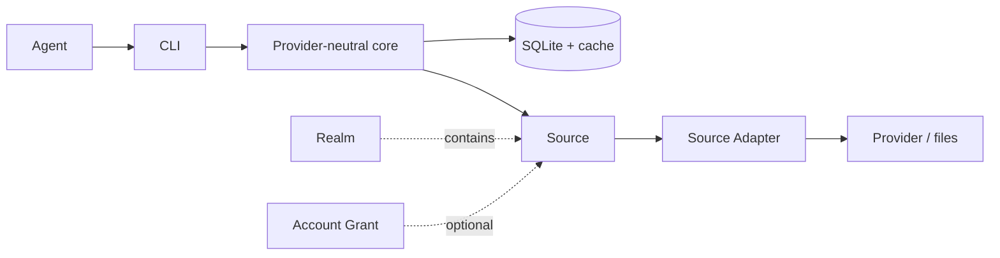
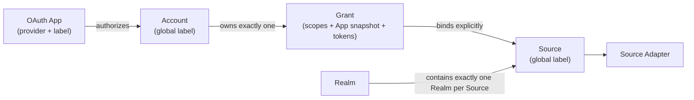
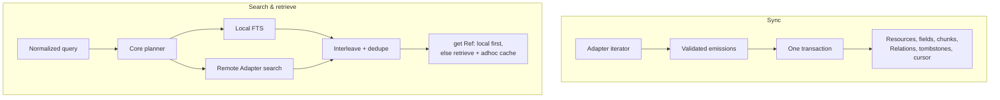

# ctxindex System Reference

> **NON-NORMATIVE — readable projection, not the contract.** If this document conflicts with a capability specification, `openspec/specs/<capability>/spec.md` wins.
>
> **Last refreshed:** 2026-07-20
>
> **Sources consulted:** `README.md`; `CONTEXT.md`; all canonical capability specs and implementation sidecars present on 2026-07-20, including `core-model/implementation.md` and `extension-documentation/implementation.md`; all eight delta specs plus the proposal, design, and implementation artifacts in `redesign-extension-sdk`; the `make-keychain-secret-index-consistent` change, including its `.openspec.yaml`, proposal, design, implementation, tasks, and account-grant-management and secret-backend-operations delta specs; the `add-extension-documentation-trees`, `agent-orientation-guidance`, `add-git-extension-catalogs`, `add-threaded-reply-drafts`, `add-docs-web-surface`, and `separate-sync-warning-error-accounting` changes; decisions D1–D22 in `docs/design/2026-07-13-context-access-layer.md`; `.agents/skills/repo-development/SKILL.md`; and current CLI help/registry output. Section 13 is the full index.

## 1. 10-minute tour

ctxindex gives agents one command vocabulary for context spread across providers and local files. A message, calendar event, and file all become **Resources** with stable `ctx://` **Refs**. Providers and files remain canonical; ctxindex keeps local projections and caches for search, retrieval, Relations, export, and narrowly typed **Actions**.



Sync transactionally materializes a Source; live search/retrieval returns the same Ref shape and may leave purgeable ad-hoc cache entries.

### A real local end-to-end journey

These development commands were checked against the current CLI. With an installed binary, replace `bun cli` with `ctxindex`.

```sh
mkdir -p /tmp/ctx-tour
printf 'Quarterly planning notes for Project Aurora.\n' > /tmp/ctx-tour/plan.txt

bun cli init
bun cli realm add work
bun cli describe adapter local.directory --json
bun cli source add local.directory \
  --realm work --label work-files \
  --config-root-path /tmp/ctx-tour
bun cli source list --json
bun cli sync --source work-files --json
bun cli search planning --realm work --kind file --local-only --json
bun cli get 'ctx://<SOURCE_ULID>/file/plan.txt' --json
bun cli status --source work-files --json
```

Expected output shapes, omitting generated ids and timestamps:

| Command | Shape and meaning |
| --- | --- |
| `init` | Readable initialization confirmation. It creates no implicit Realm. |
| `describe adapter … --json` | Adapter `id`, Profiles, optional Provider/access binding, routing, capabilities, config JSON Schema, and generated config options such as `--config-root-path`. |
| `source list --json` | Array of Sources with id, label, Realm, Adapter, config, availability, and sync counts. Public inventory does not expose the private Grant link. |
| `sync … --json` | `{ "mode": "sync", "results": [{ "sourceId": "…", "status": "completed", "run": { "runId": "…", "mode": "sync", "status": "completed", "added": 1, "updated": 0, "deleted": 0, "warningsCount": 0, "lastWarning": null, "errorsCount": 0, "warnings": [] } }], "warnings": [] }` |
| `search … --json` | `{ "results": [{ "ref": "ctx://…/file/plan.txt", "profile": { "id": "file", "version": 1 }, "origin": "local", "title": "plan.txt", "chunks": [{ "index": 0, "snippet": "…planning…" }] }], "pagination": { "offset": 0, "limit": 20, "hasMore": false }, "warnings": [] }` |
| `get … --json` | `{ "resource": { "ref": "ctx://…", "realmId": "work", "profile": { "id": "file", "version": 1 }, "origin": "synced", "payload": { "path": "plan.txt", "mediaType": "text/plain", "text": "…" } }, "warnings": [] }` |
| `status … --json` | Array with Source availability, last status/run, separate warning/error counts, last structured warning, bounded last error, and opaque Adapter cursor. |

OAuth Sources first need an available OAuth App. Local BYOA uses `oauth-app add <provider> <label> --from-env`; `account add <provider> --app <label>` authorizes through that exact App, and `source add` binds the resulting Account with `--account`. Before mutating provider state, inspect `action describe <id> --source <source> --json`. V1 only creates or updates email Drafts; it never sends them.

Trusted Git Catalogs use a separate acquisition and execution acknowledgement. Add and command-time refresh resolve one full ref to an immutable commit snapshot; install validates and activates one exact Extension without changing it on later refreshes. Catalog list/show/install refresh by default, while `--no-refresh` uses the stored snapshot and reports its age. Startup and loaded-Extension listing stay offline:

```sh
bun cli extensions catalog add team /absolute/catalog-repo --ref refs/heads/main --trust
bun cli extensions catalog show team --json
bun cli extensions install team example.extension@1 --trust
bun cli extensions list --json
```

Packages can also be installed directly from npm, Git, or a local directory. The selector chooses exactly one Extension root; update reuses the stored target, while startup uses only the immutable local pin:

```sh
bun cli extensions install npm @example/ctxindex-extension --extension example.extension
bun cli extensions update example.extension
bun cli extensions uninstall example.extension
```

## 2. Overview and value proposition

ctxindex is a **local personal-context gateway** with four operations over the same configured Sources:

- **Discover** through local full-text/typed indexes, provider search, or both.
- **Retrieve** a complete Resource, thread, Artifact, or Profile export by Ref.
- **Sync** a Source into a searchable local projection with durable cursor history.
- **Act** through a Profile-declared provider mutation bound to one explicit Source.

This is a deterministic access model, not a canonical database. A Ref survives synced, remote, cached, and temporarily unavailable states.

The CLI is the agent integration surface. Agents compose generic commands with `--json`; loaded registries define valid kinds, fields, Source options, exports, and Actions. There is no provider-specific command family, SaaS canonical store, workflow-policy engine, arbitrary Extension command surface, or MCP server in the current product.

The public landing and documentation web surface is a non-normative projection of those contracts. Documentation pages are prerendered, while site search needs a compatible Next.js server or serverless runtime. The site stores no ctxindex user or provider state and does not operate a hosted Extension marketplace.

Package responsibilities are stable: the public unscoped `ctxindex` package parses, composes, formats, and maps final exits; private workspace packages `@ctxindex/core`, `@ctxindex/extension-sdk`, `@ctxindex/profiles`, and `@ctxindex/adapters` respectively own provider-neutral runtime and storage, public authoring contracts, bundled vocabulary, and provider transport and normalization.

## 3. Domain model

| Term | Meaning |
| --- | --- |
| **Realm** | User-created reasoning/search scope containing Sources. Omitted filters span all Realms; explicit filters are exact. No `global` Realm exists. |
| **Source** | One globally labeled connection through one Source Adapter, in exactly one Realm, optionally bound to one Grant. |
| **Provider** | Reusable external-service identity, authentication, registration, base-scope, and allowed-host definition. |
| **OAuth App** | Labeled OAuth application definition for one Provider, supplied by an Extension or configured locally. Identity is `(provider id, label)`. |
| **Account** | Stable authenticated provider identity with a globally unique local label. Verified addresses are Account Identities, not the key. |
| **Grant** | One stable private permission/token/App-snapshot record owned by one Account and shareable by compatible Sources. |
| **Profile** | Versioned Resource schema and vocabulary: projections, fields, Relations, Artifacts, exports, aliases, and Actions. |
| **Action** | Typed provider mutation declared by a Profile and implemented through one Source Adapter. |
| **Draft** | Reversible provider-persisted proposed message; conversation text alone is not a Draft. |
| **Extension** | Plain exported root bundling Source Adapters and OAuth Apps, plus optional standalone Providers/Profiles; it has no command surface or dependency graph. |
| **Source Adapter** | Provider-bound or providerless implementation of declared sync, remote-search, retrieve, download, and Action operations. |
| **Capability** | Declared operation class, not a provider permission or Action. |
| **Resource** | Common envelope naming one primary Profile, with an optional payload conforming to it. |
| **Ref** | `ctx://<source-id>/<adapter-opaque-suffix>`, stable independently of local materialization. |
| **Relation** | Typed edge to a Ref or natural key that may resolve later. |
| **Artifact** | Source-scoped, Profile-derived descriptor for downloadable bytes associated with one Resource. Cached bytes are a separate, purgeable local representation. |
| **Materialization** | Purgeable local projection from Sync or ad-hoc access. |
| **Field Index** | Generic typed rows projected from Profile fields. |
| **Sync Run** | One recorded refresh attempt, separate from current Source state. |

Internal row ids are not Refs; the public Resource identity is its Source-scoped Ref. Provider and local identifiers may appear in Source-scoped Resource Refs, envelope metadata, or typed Profile fields, but core has no separate external-reference store. For `communication.message`, the normalized RFC `Message-ID` header value is the typed `rfcMessageId` Profile field. The same provider record exposed by two Sources remains two Resources; natural-key Relations resolve typed fields through the Field Index with zero-to-many exact-value matches across Sources and Realms, without collapsing Source-scoped identities. Relations are order-independent and bidirectional, and may resolve after a target arrives. Generic threading uses conversation and parent edges rather than mail-specific tables.

## 4. Trust boundaries and security model

Indexed content stays in local SQLite under the user's home; providers and files remain canonical, and local directory Sources index in place. SQLite, logs, and the secrets store are user-controlled; secrets-related files use `0600` and parent directories use `0700` where feasible. SQLite and config hold typed secret references, not cleartext; values live in the configured OS Keychain or optional encrypted file backend. Recognized references are `keychain:<service>/<account>/<key>`, `file:<path>#<key>`, and centrally loaded `env:<VAR>`/`env://<VAR>`. Bare secrets are rejected.

Local OAuth App config is read only during `oauth-app add … --from-env`, using the selected Provider's complete typed environment mapping, validated before persistence, and stored through secret references. Extension Apps carry public registration metadata instead. Authorization snapshots the exact selected App config into the private Grant; refresh uses that snapshot even after the App is removed. Tokens, App config values, passphrases, and authorization codes do not enter literal command arguments or safe inventory.

A backend move copies and verifies target entries before switching durable references and configuration, then cleans old entries. Typed prefixes keep an interrupted mixed state readable. Within one ctxindex process, all Keychain writes, deletes, inventory reads, and probes serialize across backend instances so concurrent updates cannot discard one another. A new credential is published to the reserved inventory before its value is written. If the value write reports failure, ctxindex attempts to restore the prior inventory; if restoration also reports failure, the original value-write failure remains authoritative, no reference or success is returned, the intended inventory entry may remain, and ctxindex makes no claim that a failed native call did or did not take effect. A failed delete remains discoverable for retry. The availability probe reuses one reserved credential identity in a service outside the normal scoped-secret namespace and always attempts cleanup after a successful write, so failures neither accumulate uniquely named probe rows nor collide with user/provider secrets. An unavailable configured backend causes failure; no implicit fallback occurs.

Provider requests pass through central authorized fetch with declared host restrictions. Logs redact known sensitive fields, and the reference system emits no telemetry or update pings.

External Extensions are explicitly configured TypeScript/JavaScript loaded in-process with full trust. Runtime validation protects registry consistency, not the host from malicious code. Catalog commands acquire credential-free Git snapshots; direct install/update explicitly acquire npm, Git, or local packages. Both paths pin immutable local snapshots, reject credential-bearing targets, disable lifecycle scripts, and surface execution trust before code import. Startup, loaded-Extension listing, uninstall, and removal never acquire or revisit the original target. Catalog Git acquisition additionally rejects userinfo, query, fragment, localhost, and literal loopback, IPv4-mapped, private, unique-local, link-local, site-local, unspecified, or multicast destinations. A Realm scopes reasoning and search, not credentials or filesystem access; auth isolation comes from Account, Grant, Source binding, and host restrictions.

## 5. Extension architecture

Profiles own pure domain semantics: schema validation, title/summary/chunk projections, typed fields, Relations, Artifact descriptors, exports, aliases, and Action declarations. Providers own reusable external-service auth, registration, base scopes, identity, and allowed hosts. Adapters own Source config, routing, requested access, provider I/O, response validation, normalization, and implementations. Core receives normalized Resources, warnings, sync emissions, bytes, and Action results rather than provider DTOs. Documentation is a separate sidecar rather than executable definition metadata.

`defineProfile`, `defineProvider`, `defineOAuthApp`, `defineAdapter`, and `defineExtension` are side-effect-free, inference-preserving factories for discriminated plain values; the SDK also exports its supported Zod instance. Adapters and Apps import exact Provider/Profile values, so TypeScript preserves types when packages are available. There are no string reference factories, host callback, global registration, or Extension dependency graph: npm, Git, or local package dependencies acquire code, while normal imports express reuse.

An Extension root may declare one passive documentation sidecar with the pure `docs('./docs')` descriptor or an eager virtual tree. Core binds directory form to the already acquired definition module, validates both forms through the same bounded resolver, then removes the declaration before definition-registry activation. Extension, Provider, Profile, and Adapter ids share a bounded lowercase ASCII route-safe grammar. Trees require `README.md`; Provider and Adapter pages use stable-id routes, Profile pages use exact `id@version` routes, and an unversioned Profile alias exists only when unambiguous. Authored Markdown/assets remain separate from deterministic generated JSON reference data. Core exposes the transport-neutral projection as passive data for future CLI, agent, and local-web consumers. The projection exposes no host path or URL and is not trusted HTML; presentation consumers remain deferred, and any future browser renderer must sanitize again and prevent network-loaded media.

One package declares ordered Extension entry modules in `package.json` under `ctxindex.extensions`. Each entry may export one or more named/default Extension roots; the collector ignores unrelated exports and never invokes arbitrary callbacks. A root contributes its Adapters and Apps, transitively collects their exact Providers/Profiles, and may list standalone leaves. The complete candidate registry is staged and validated atomically. Same-object reuse may coalesce; distinct executable or schema-bearing same-id values conflict because JavaScript cannot prove equivalence; only genuinely pure declarative values may coalesce by canonical structural equality. OAuth App duplicates always conflict.

Adapters may be provider-bound or providerless. Providerless operation is a real mode rather than a synthetic local Provider: it cannot declare Provider access/egress or create OAuth App, Account, or Grant state. The four operation capabilities are `sync`, `search-remote`, `retrieve`, and `download`; each declared capability needs its implementation. Actions are separate Profile bindings.

Adapters receive host-provided operation contexts: Source identity/config, cancellation, scoped logging, allowlisted authorized fetch, declared secret access, Artifact sink, and operation-specific emission. They neither import core runtime internals nor write tables.

V1 loads trusted `.ts`/`.js` Extensions from bundled packages, explicit local package roots, exact installed Catalog provenance, and immutable direct npm/Git/local package pins through the same manifest-entry, collector, documentation-resolver, and registry seams. Built-in source documentation is staged into validated embedded virtual trees so relocated compiled binaries need no checkout files. Built-ins currently publish no official OAuth App metadata; BYOA remains available. Import, manifest, documentation, schema, duplicate-id, or capability failure becomes a diagnostic and rejects that package atomically. Direct-install failures degrade per Extension without fetching or invalidating unrelated candidates. Built-in selection/override UX, sandboxing, and out-of-process/non-TypeScript Adapters are deferred. Bun is pinned to 1.3.14 for compiled distribution and external TypeScript Extension compatibility.

If an Extension disappears, Sources become `extension_unavailable`. Existing local Resources remain searchable, degrading to their envelope when vocabulary is missing; provider operations stop. Restoring the Extension restores availability without deleting data.

A Git Catalog root contains one strict, bounded `ctxindex-catalog.json` with inline source entries and optional prose setup files. Acquisition validates committed files and contained paths before atomically switching the Catalog pin. Installed provenance separately records Catalog identity, repository, commit, snapshot acquisition time, exact `(id, version)`, and relative source path, so refresh never upgrades or executes installed code. Install validates the replacement against the runtime-complete registry before activation; only exact prior Catalog provenance is replaceable, while built-in/path conflicts and other invalid replacements preserve the prior record. Identical provenance is idempotent. Missing installed snapshots produce diagnostics without fetching. Uninstall removes activation metadata only, and Catalog removal is blocked while an installed record references it; snapshots, Sources, and Resources remain intact.

## 6. OAuth Apps, Accounts, Grants, and Realms



An OAuth App is either public metadata contributed by an active trusted Extension or local BYOA config persisted through typed secret references. Its identity is exact `(provider id, label)`; neither origin may shadow another. Safe inventory reports only Provider id, label, origin, and safe provenance. Removing a local App cleans its config and affects only future authorization because existing Grants own snapshots.

`account add <provider> --app <label>` selects exactly one available App. Omission or mismatch fails before browser or network effects and reports available labels or `oauth-app add` guidance. Consent combines the exact Provider's base scopes with the sorted union of active Provider-backed Adapters' operation scopes. Providerless Adapters contribute nothing, and authorization has no one-off Adapter selector. Echoed operation scopes are checked exactly; refresh preserves previous scopes when the provider omits them.

The provider’s stable subject identifies the Account; email is a verified identity and default-label candidate. Reauthorization updates the same Account and single stable Grant in place. Authorization, refresh, and removal for the same exact Account serialize within one ctxindex process and re-read current Grant state before mutation, so concurrent replacements leave only the final committed references authoritative. “Live Grant refs” means refs selected by the committed Grant row; superseded physical secret rows may remain pending cleanup but are not live authorization state. Removal also revalidates its exact label after waiting; a concurrent rename makes the stale label fail rather than deleting the renamed Account. Replacement App/token references commit before old entries are deleted. If that cleanup cannot finish, the new Grant remains usable and the log receives one bounded warning whose bindings are exactly Provider id, Grant id, lifecycle phase, and failed-entry count. Account id, secret refs or values, backend errors, and other sensitive fields stay out of it. Refresh follows the same rule for rotated tokens. A new explicit label renames the Account rather than duplicating it.

An authenticated Source resolves `--account` by exact Account label, then Account id within the Adapter's exact Provider. Core checks scope compatibility; Grants remain private and are not public selectors. No “active” or newest credential fallback exists; compatible Sources can deliberately share one Grant across Realms. A providerless Source needs no Account and never enters authorization or refresh.

Every Source names an existing Realm. Source labels default to `<account-label>-<adapter-tail>`, or `<adapter-tail>` without auth, and are globally unique. Collisions fail unchanged—no normalization, prompting, overwrite, or suffixing.

Removing an Account commits Account/Grant deletion and leaves Sources configured with cleared links and `needs_auth` before physical secret cleanup. That committed state remains authoritative if cleanup fails; removal still succeeds with the bounded redacted warning, and typed-ref deletion is safe to retry idempotently without restoring authorization state. Re-adding the identity creates a fresh Grant without silently rebinding preserved Sources.

## 7. Search and sync behavior



Search accepts text, filters, or both. Query-less search needs a filter, stays local, and enumerates projections; bare `search` is invalid. Profile-defined kinds, aliases, fields, and typed values reject bad filters before I/O.

Routing precedence is CLI override (`--local-only`/`--remote`), Source override, then Adapter routing. Indexed coverage uses local search; federated Sources use provider search; hybrid Sources can add a remote leg when local coverage is insufficient. Query-less `--remote` is invalid. Exact Realm/Source filters apply before execution.

Core round-robin interleaves incomparable local/provider rankings and deduplicates Refs. Remote failure becomes a warning while local results survive. Explain reports route, legs, coverage, and degradation.

Filter-only local enumeration orders occurrence time descending, missing times last, then Ref. Local-only pagination uses offset/limit and returns `hasMore`; offset is rejected for remote or mixed queryful searches. Remote pagination and filter-only remote enumeration are deferred.

`get <ref>` returns complete local state first. Otherwise, core invokes that Source’s `retrieve`, requires the requested Ref, validates the payload, and caches complete `adhoc` state. Remote search may cache only an envelope; a later get hydrates it. Syncing the same Ref upgrades one row to `synced`.

A sync-capable Adapter emits upserts, removals, checkpoints, and warnings. Core records a Sync Run and transactionally applies Resources, projections, Relations, tombstones, and final cursor. Historical runs and current Source state retain separate warning/error counts plus the last structured warning and bounded error summary. Warning-only completion remains successful; a later terminal failure preserves prior warnings and contributes one error. Failure preserves the prior durable cursor; checkpoints do not become current before completion. `sync` is baseline; `resync` and `diff` depend on Adapter support, and `diff` validates while rolling back materialized changes.

A global advisory lock prevents overlapping syncs. A second attempt records failed `sync busy` because it was not explicitly cancelled; readers continue. SQLite uses WAL, foreign keys, normal synchronous mode, and bounded busy timeout. Synced deletion creates a tombstone hidden from ordinary search; deleting an ad-hoc cache entry does not.

## 8. Provider coverage and limitations

Both calendar Adapters emit `calendar.event@1`, sync one calendar in an anchored rolling window, retrieve through `get`, and expose no write Action. Timed events keep instants/zones; all-day events keep half-open dates. Incomplete scans preserve prior state.

`google.calendar` defaults to the primary calendar or selects one explicit id. Initial sync commits only the final token after all pages. Token invalidation warns and triggers bounded full reconciliation. Missing events cause removals only after a complete scan. Unsupported variants such as `fromGmail` and `workingLocation` are skipped with `google_calendar_unsupported_event`; `birthday` becomes an ordinary all-day event. Retrieval rejects foreign-Source Refs before auth/network access.

`microsoft.calendar` supports personal and organizational Accounts. The default calendar uses stable Graph calendar-view delta; a named calendar uses complete paged stable-version scans and manifest reconciliation instead of the beta per-calendar delta route. Requests use immutable-id and UTC preferences. Unmapped Windows time zones can warn with `microsoft_calendar_unresolved_series_start`.

The calendar specs conflict on recurring Google identity: `calendar-context` describes one series Resource plus changed/cancelled exceptions, while `google-calendar-adapter` describes each expanded occurrence as a distinct stable Resource. This reference cannot choose; recurrence storage needs canonical clarification.

`microsoft.mailbox` covers remote search, retrieval, conversation Relations, file attachments, exports, and Drafts; immutable Graph IDs preserve Refs across moves. Shared contracts cover Gmail search/Actions, but no dedicated Gmail mailbox spec establishes provider transport details.

`local.directory` is unauthenticated and indexed, with one root and file Resources. Fine-grained scanner behavior should be discovered from the loaded registry: there is no dedicated local-directory ingestion specification. Likewise, Profile expressibility for tasks, files, communication, calendars, and external domains does not imply complete bundled Adapter coverage.

## 9. Typed Actions and Drafts

Profiles declare Action id, input schema, output Profile, effect, docs, and examples. Adapters bind provider implementations. `action describe` reports the registry contract and per-Source availability; `action run` requires one Source, validates all input before provider I/O, invokes once with automatic unauthorized retry disabled, validates output, and may cache the result as complete `adhoc` state.

V1 exposes exactly:

- `communication.message.draft.create`
- `communication.message.draft.update`

Google and Microsoft mailbox Adapters bind the same strict provider-independent unions. Standalone create returns a normalized message Resource; standalone update replaces complete recipients, subject, and text for an existing same-Source Draft while preserving its Ref.

The reply branch accepts only a same-Source parent Ref and body text. Before authentication or provider I/O, it resolves complete local message state, rejects missing, partial, deleted, cross-Source, and Draft parents, and derives the first Reply-To or From recipient, deterministic subject, and thread headers. Callers cannot override recipients or subject, and reply-all is absent. Gmail writes one MIME Draft into the parent's thread. Microsoft uses Graph's native `createReply`; later reply updates prove the locally stored parent is unchanged before one PATCH. Standalone update cannot erase a locally stored reply Draft's immutable context. Both return a complete Draft Resource with stable Ref and `replyToRef`.

There is no send, reply-send, forward-send, calendar mutation, or other provider mutation. Microsoft’s narrow Draft-capable permission includes message write access but excludes `Mail.Send`. Ambiguous mutation outcomes are not automatically retried. Agent wording, approval, and workflow policy stay outside ctxindex; text becomes a Draft only after provider persistence succeeds.

The generic model can describe irreversible Actions and requires explicit non-interactive confirmation, but no irreversible Action ships.

## 10. Storage model

`@ctxindex/core` owns generic SQLite storage, schema changes, sync bookkeeping, and the managed Artifact-byte cache. Adapters own no tables. A Resource stores internal id, Ref, Source/Realm, Profile/version, `synced` or `adhoc` origin, completeness, envelope times/text, validated payload, and derived fields, chunks, Relations, and Artifact descriptors.

Field Index rows keep each scalar/array element in a native text, numeric, or integer slot with ordinal. Chunks feed full-text search. Updating a payload transactionally replaces all Profile-derived projections.

Relations store one logical edge and zero-to-many resolutions. Ref targets resolve directly; natural keys may dangle and resolve later through typed Field Index values across Sources and Realms. Every match remains a distinct Source-scoped Resource. Tombstoned targets remain linked but hidden by default; evicted ad-hoc targets can resolve again if rematerialized.

Remote envelopes, retrieved payloads, and synced content share Resource tables. `adhoc` is purgeable cache state; Sync upgrades an identical Ref to `synced`, while synced provider deletion creates a tombstone. Optional raw provider payloads are off by default, non-authoritative, and purgeable.

Artifact descriptors remain with Resources while provider bytes are fetched on demand. First download streams the bytes into a SHA-256 content-addressed cache and records metadata under the sole `cached` retention class. Later downloads reuse it; `--output` copies without transferring cache ownership. `purge artifacts` removes bytes and cache metadata but leaves Resources and their descriptors for refetch. No automatic eviction exists.

Core bookkeeping timestamps use UTC Unix-epoch milliseconds; Profile payloads may preserve RFC 3339 instants or local dates. Opaque ctxindex-owned primary keys are client-generated ULIDs; a Realm uses its human slug as primary key, or a ULID without one. Provider IDs are never core primary keys. Exports resolve formats from Profiles, not a core conversion pipeline. A basic backup stops Sync, then copies SQLite and the encrypted secret file when used. External systems remain canonical. Prototype databases have no compatibility obligation; cross-Source Resource collapse, canonical identity, merge policy, Extension-private tables, and payload-version migration are deferred.

Catalog and installed-Extension records are strict TOML with portable repository, ref, commit, snapshot acquisition time, and relative source/setup fields. Direct-install records are strict versioned JSON with sanitized requested provenance, exact npm version/integrity, Git commit, or normalized local origin, plus a content digest and relative package root. Managed absolute paths are never persisted: locations derive beneath the data directory and remain retained immutable data rather than SQLite domain records.

## 11. CLI surface and stable exit codes

The CLI is deterministic and non-interactive. Input comes from non-secret flags, declared environments, typed references, files, or declared stdin. Missing input fails instead of prompting. The only interactive surface is a browser in an explicitly requested OAuth loopback.

Readable output is compact; JSON goes to stdout and diagnostics to stderr. Registry-backed `describe` owns fields, formats, config flags, OAuth declarations, and Action schemas, avoiding duplicated help.

Generic verbs cover initialization, OAuth App/Account/Realm/Source management, sync, search, get, threads, Artifacts, exports, Actions, status, purge, Extensions, secrets, and bundled skills. `oauth-app add <provider> <label> --from-env`, `oauth-app list [--json]`, and `oauth-app remove <provider> <label>` are the complete local App grammar; there is no `client` alias or literal-config argument. Exact labels/ids resolve without auto-creation. Bundled skills provide concise orientation to what ctxindex is, when to use it, and the live discovery surfaces; generated help and loaded-definition output remain authoritative for interface facts.

Catalog distribution adds deterministic `extensions catalog add|list|show|refresh|remove`, `extensions install`, and `extensions uninstall` commands. Add requires repository trust; install independently requires execution trust. List/show/install refresh involved Catalogs by default; `--no-refresh` explicitly uses stored state and every stored-snapshot output includes age. Direct distribution uses `extensions install <npm|git|local> <target> --extension <id>`, `extensions update <id>`, and `extensions uninstall <id> [--force]`. Invalid selectors exit `2` before acquisition, import, or state mutation. Normal direct uninstall is blocked when it would strand Source Adapter bindings; forced uninstall preserves Source-owned state. Loaded-Extension listing reports exact persisted provenance without refreshing.

| Exit | Stable meaning | Caller response |
| ---: | --- | --- |
| `0` | Success | Consume stdout; inspect warnings. |
| `2` | Invalid usage | Correct arguments, schema input, filter, label, or selection. |
| `10` | `needs_auth` | Reauthorize the affected Account. |
| `20` | Rate limited | Back off; use `retryAfterMs` when present. |
| `30` | Network/provider failure | Preserve local results and apply workflow retry policy. |
| `40` | Permission denied | Correct provider permission or Grant scope. |
| `50` | Other sync failure | Inspect status and diagnostics. |
| `130` | SIGINT cancellation | Treat as interrupted; prior durable cursor remains valid. |

Sync Run history records `completed`, `cancelled` for cancellation, and `failed` otherwise. Current Source state becomes `idle` after completion, `needs_auth` for expired/revoked auth, and `failed` for cancellation and other terminal errors; only the CLI sets `disabled`. Warnings increment warning accounting without changing error counts, terminal status, or a successful exit code.

## 12. Known limitations and deferrals

- Provider mutations stop at reversible email Draft create/update; sending and calendar writes are absent.
- Gmail mailbox and local-directory ingestion lack dedicated capability specs; shared contracts and registry discovery set their documented boundary.
- Recurring Google event identity has an unresolved conflict between two canonical specs.
- Profile expressibility does not equal complete bundled provider coverage for tasks, files, communication, or arbitrary Extension domains.
- Full-text search is baseline; semantic/vector search, watch/notifications, and mature quota policy are optional or deferred.
- Remote filter-only enumeration, remote pagination, and mixed-search offset pagination are unsupported.
- `resync` and `diff` depend on Adapter support; `sync` is baseline.
- Cached Artifact bytes have one retention class and no automatic eviction. Raw provider payloads are optional and off by default.
- External Extensions are trusted in-process bundled, explicit-path, installed Catalog, or directly installed npm/Git/local package code. Sandboxing, ambient discovery or startup refresh, arbitrary commands, private/credentialed or SSH Catalogs, nested or cross-repository Catalog entries, submodules, Git LFS, build hooks, polling, and non-TypeScript/out-of-process Adapters are unsupported. Package dependencies used by an acquired package remain ordinary imports; ctxindex has no Extension dependency graph.
- Built-in selection/override UX and documentation consumers, including CLI, agent, and browser rendering of Extension trees, remain deferred. Bundled Google and Microsoft definitions currently publish no official OAuth Apps; users configure BYOA Apps until approved public metadata is supplied.
- Per-Extension storage, multiple primary Profiles, cross-source identity collapse, and payload migration await demonstrated need.
- There is no SaaS canonical store, MCP server, workflow-policy engine, or universal sync protocol.
- The documentation site needs a Next.js server or serverless runtime for search; static file hosting alone is insufficient. Deployments should configure their canonical public origin for absolute social metadata.
- Realms organize context but do not isolate credentials or Relation resolution.
- Export stability needs an explicit release declaration. Pre-release prototype data and command compatibility are not preserved.
- Live-provider checks require human approval and redacted evidence; automation uses isolated state and loopback providers.

## 13. Source index

Capability specifications are normative. Sidecars and design/skill documents explain intended implementation and rationale. The exact sources below cover the canonical capability specs and sidecars present on 2026-07-20; every affected row also consults the matching delta spec in `openspec/changes/redesign-extension-sdk/specs/` and, where relevant, that change's `implementation.md`.

| Section | Exact sources distilled |
| --- | --- |
| 1 | `README.md`; `CONTEXT.md`; `openspec/specs/core-model/spec.md`; `openspec/specs/cli-surface/spec.md`; `openspec/specs/cli-surface/implementation.md`; `openspec/specs/realm-and-source-management/spec.md`; `openspec/specs/realm-and-source-management/implementation.md`; `openspec/specs/search-routing/spec.md`; `openspec/specs/search-routing/implementation.md`; `openspec/specs/sync-operations/spec.md`; `openspec/specs/sync-operations/implementation.md`; `openspec/specs/retrieval-and-artifacts/spec.md`; `openspec/specs/retrieval-and-artifacts/implementation.md`; `openspec/changes/add-git-extension-catalogs/specs/extension-catalogs/spec.md`; `.agents/skills/repo-development/SKILL.md` |
| 2 | `openspec/specs/core-model/spec.md`; `openspec/specs/core-model/implementation.md`; `openspec/specs/module-architecture/spec.md`; `openspec/specs/module-architecture/implementation.md`; `openspec/changes/add-docs-web-surface/specs/docs-web-surface/spec.md`; `openspec/changes/add-docs-web-surface/implementation.md`; `openspec/specs/docs-web-surface/implementation.md`; `docs/design/2026-07-13-context-access-layer.md`; `README.md` |
| 3 | `CONTEXT.md`; `openspec/specs/core-model/spec.md`; `openspec/specs/core-model/implementation.md`; `openspec/specs/generic-storage/spec.md`; `openspec/specs/generic-storage/implementation.md`; `openspec/specs/profile-vocabulary/spec.md`; `openspec/specs/profile-vocabulary/implementation.md`; `openspec/specs/realm-and-source-management/spec.md` |
| 4 | `openspec/specs/core-model/spec.md`; `openspec/specs/secret-backend-operations/spec.md`; `openspec/specs/secret-backend-operations/implementation.md`; `openspec/specs/account-grant-management/spec.md`; `openspec/specs/account-grant-management/implementation.md`; `openspec/specs/extension-loading/spec.md`; `openspec/specs/extension-loading/implementation.md`; `openspec/specs/extension-documentation/spec.md`; `openspec/specs/extension-documentation/implementation.md`; `openspec/changes/add-git-extension-catalogs/specs/extension-catalogs/spec.md`; `openspec/specs/extension-catalogs/implementation.md`; `docs/design/2026-07-13-context-access-layer.md` |
| 5 | `openspec/specs/extension-loading/spec.md`; `openspec/specs/extension-loading/implementation.md`; `openspec/specs/extension-documentation/spec.md`; `openspec/specs/extension-documentation/implementation.md`; `openspec/specs/profile-vocabulary/spec.md`; `openspec/specs/profile-vocabulary/implementation.md`; `openspec/specs/module-architecture/spec.md`; `openspec/specs/module-architecture/implementation.md`; `openspec/changes/add-extension-documentation-trees/implementation.md`; `openspec/changes/add-git-extension-catalogs/specs/extension-catalogs/spec.md`; `openspec/changes/add-git-extension-catalogs/specs/extension-loading/spec.md`; `openspec/specs/extension-catalogs/implementation.md`; `docs/design/2026-07-13-context-access-layer.md` |
| 6 | `openspec/specs/core-model/spec.md`; `openspec/specs/core-model/implementation.md`; `openspec/specs/oauth-client-management/spec.md`; `openspec/specs/oauth-client-management/implementation.md`; `openspec/specs/account-grant-management/spec.md`; `openspec/specs/account-grant-management/implementation.md`; `openspec/specs/realm-and-source-management/spec.md`; `openspec/specs/realm-and-source-management/implementation.md`; `openspec/specs/generic-storage/spec.md`; `openspec/specs/cli-surface/spec.md` |
| 7 | `openspec/specs/search-routing/spec.md`; `openspec/specs/search-routing/implementation.md`; `openspec/specs/sync-operations/spec.md`; `openspec/changes/separate-sync-warning-error-accounting/specs/sync-operations/spec.md`; `openspec/specs/sync-operations/implementation.md`; `openspec/specs/retrieval-and-artifacts/spec.md`; `openspec/specs/retrieval-and-artifacts/implementation.md`; `openspec/specs/generic-storage/spec.md`; `openspec/changes/separate-sync-warning-error-accounting/specs/generic-storage/spec.md`; `openspec/specs/error-taxonomy/spec.md`; `openspec/changes/separate-sync-warning-error-accounting/specs/error-taxonomy/spec.md`; `openspec/specs/error-taxonomy/implementation.md` |
| 8 | `openspec/specs/calendar-context/spec.md`; `openspec/specs/calendar-context/implementation.md`; `openspec/specs/google-calendar-adapter/spec.md`; `openspec/specs/google-calendar-adapter/implementation.md`; `openspec/specs/microsoft-graph-adapters/spec.md`; `openspec/specs/microsoft-graph-adapters/implementation.md`; `openspec/specs/provider-actions/spec.md`; `openspec/specs/search-routing/spec.md`; `openspec/specs/realm-and-source-management/spec.md`; `docs/design/2026-07-13-context-access-layer.md` |
| 9 | `CONTEXT.md`; `openspec/specs/provider-actions/spec.md`; `openspec/specs/provider-actions/implementation.md`; `openspec/specs/profile-vocabulary/spec.md`; `openspec/specs/profile-vocabulary/implementation.md`; `openspec/specs/account-grant-management/spec.md`; `openspec/specs/microsoft-graph-adapters/spec.md`; `openspec/specs/microsoft-graph-adapters/implementation.md`; `openspec/changes/add-threaded-reply-drafts/specs/provider-actions/spec.md`; `openspec/changes/add-threaded-reply-drafts/specs/profile-vocabulary/spec.md`; `openspec/changes/add-threaded-reply-drafts/specs/microsoft-graph-adapters/spec.md`; `openspec/changes/add-threaded-reply-drafts/specs/retrieval-and-artifacts/spec.md`; `openspec/changes/add-threaded-reply-drafts/implementation.md` |
| 10 | `openspec/specs/core-model/spec.md`; `openspec/specs/generic-storage/spec.md`; `openspec/changes/separate-sync-warning-error-accounting/specs/generic-storage/spec.md`; `openspec/specs/generic-storage/implementation.md`; `openspec/specs/retrieval-and-artifacts/spec.md`; `openspec/specs/retrieval-and-artifacts/implementation.md`; `openspec/specs/sync-operations/spec.md`; `openspec/changes/separate-sync-warning-error-accounting/specs/sync-operations/spec.md`; `openspec/specs/sync-operations/implementation.md`; `openspec/changes/add-git-extension-catalogs/specs/extension-catalogs/spec.md`; `openspec/specs/extension-catalogs/implementation.md`; `docs/design/2026-07-13-context-access-layer.md` |
| 11 | `openspec/specs/cli-surface/spec.md`; `openspec/changes/separate-sync-warning-error-accounting/specs/cli-surface/spec.md`; `openspec/specs/cli-surface/implementation.md`; `openspec/changes/agent-orientation-guidance/specs/cli-surface/spec.md`; `openspec/changes/add-git-extension-catalogs/specs/cli-surface/spec.md`; `openspec/specs/error-taxonomy/spec.md`; `openspec/changes/separate-sync-warning-error-accounting/specs/error-taxonomy/spec.md`; `openspec/specs/error-taxonomy/implementation.md`; `openspec/specs/profile-vocabulary/spec.md`; `openspec/specs/extension-loading/spec.md`; `.agents/skills/repo-development/SKILL.md` |
| 12 | `openspec/specs/core-model/spec.md`; `openspec/specs/search-routing/spec.md`; `openspec/changes/agent-orientation-guidance/specs/search-routing/spec.md`; `openspec/specs/sync-operations/spec.md`; `openspec/specs/retrieval-and-artifacts/spec.md`; `openspec/specs/realm-and-source-management/spec.md`; `openspec/specs/extension-loading/spec.md`; `openspec/changes/add-git-extension-catalogs/specs/extension-catalogs/spec.md`; `openspec/specs/provider-actions/spec.md`; `openspec/specs/calendar-context/spec.md`; `openspec/specs/google-calendar-adapter/spec.md`; `openspec/changes/add-docs-web-surface/specs/docs-web-surface/spec.md`; `openspec/specs/docs-web-surface/implementation.md`; `docs/design/2026-07-13-context-access-layer.md` |
| 13 | `.agents/skills/system-reference/SKILL.md`; the complete exact-path map in this table |

The remaining capability and sidecar evidence also contributes through the mapped cross-cutting sections: `openspec/specs/core-model/implementation.md`, `openspec/specs/oauth-client-management/spec.md`, `openspec/specs/oauth-client-management/implementation.md`, `openspec/specs/secret-backend-operations/spec.md`, `openspec/specs/secret-backend-operations/implementation.md`, `openspec/specs/module-architecture/spec.md`, and `openspec/specs/module-architecture/implementation.md`.
