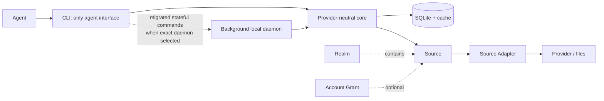
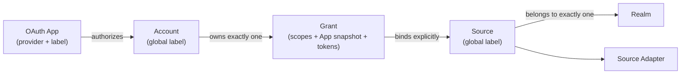
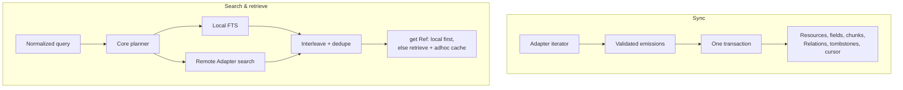

# ctxindex System Reference

> **NON-NORMATIVE — readable projection, not the contract.** If this document conflicts with a capability specification, `openspec/specs/<capability>/spec.md` wins.
>
> **Last refreshed:** 2026-07-21
>
> **Sources consulted for this refresh:** `CONTEXT.md`; the current `cli-surface`, `documentation-consumption`, `extension-documentation`, `extension-installation`, `extension-catalogs`, `extension-loading`, and `sync-operations` capability specs; their present implementation sidecars, including `daemon-operation-streams`; the active `stream-daemon-operations`, `route-extension-docs-through-daemon`, `automate-daemon-lifecycle`, `unify-cli-command-model`, and `rebuild-product-extension-sdk-docs` artifacts; and affected CLI, core, RPC, daemon, distribution, web, and Extension codemaps. Canonical capability specs take precedence over older pre-alpha interface listings. Section 13 retains the full source map.

## 1. 10-minute tour

ctxindex gives agents one command vocabulary for context spread across providers and local files. A message, calendar event, and file all become **Resources** with stable `ctx://` **Refs**. Providers and files remain canonical; ctxindex keeps local projections and caches for search, retrieval, Relations, export, and narrowly typed **Actions**.



Sync transactionally materializes a Source; live search/retrieval returns the same Ref shape and may leave purgeable ad-hoc cache entries.

This worktree also contains an active, disposable local-daemon prototype. `daemon start` launches a detached Bun daemon that can own one canonical runtime, immutable Extension registry, and SQLite database, while the CLI remains the only supported agent surface. When exact runtime discovery metadata (or a test-only endpoint override) selects that process, Realm add/list, Source add/list/remove, sync/status, search, exact get, and local thread traversal route through it without a client-side SQLite open or fallback. Initialization, OAuth App/Account/secrets, Artifact access, export, typed Actions, and purge remain direct and cannot run against that database while the daemon owns it. Ordinary commands therefore do not autostart until stateful migration reaches parity. This is measured pre-alpha behavior, not a released compatibility promise.

### A real local end-to-end journey

These development commands were checked against the current CLI. With an installed binary, replace `bun cli` with `ctxindex`.

```sh
mkdir -p /tmp/ctx-tour
printf 'Quarterly planning notes for Project Aurora.\n' > /tmp/ctx-tour/plan.txt

bun cli init
bun cli realm add work
bun cli describe adapter local.directory --json
bun cli source add local.directory \
  --realm work --label work-files \
  --config-root-path /tmp/ctx-tour
bun cli source list --json
bun cli sync --source work-files --json
bun cli search planning --realm work --kind file --local-only --json
bun cli get 'ctx://<SOURCE_ULID>/file/plan.txt' --json
bun cli status --source work-files --json
```

To exercise the prototype, initialize before starting it, then run `bun cli daemon start` and perform Realm/Source setup, sync, search, get, thread, and status through ordinary CLI commands. The detached process survives the starting CLI. Source add obtains generated config-option metadata from the daemon's immutable active registry. `bun cli daemon status --json` reports stopped, transitional, unavailable, unsupported, or health-backed running state; `bun cli daemon stop --json` requests graceful shutdown and observes ownership release. Start and stop are idempotent. Ordinary commands do not autostart until every stateful family is daemon-routed or a proven safe exception.

Expected output shapes, omitting generated ids and timestamps:

| Command | Shape and meaning |
| --- | --- |
| `init` | Readable initialization confirmation. It creates no implicit Realm. |
| `describe adapter … --json` | Adapter `id`, Profiles, optional Provider/access binding, routing, capabilities, config JSON Schema, and generated config options such as `--config-root-path`. |
| `source list --json` | Array of Sources with id, label, Realm, Adapter, config, availability, and sync counts. Public inventory does not expose the private Grant link. |
| `sync … --json` | `{ "mode": "sync", "results": [{ "sourceId": "…", "status": "completed", "run": { "runId": "…", "mode": "sync", "status": "completed", "added": 1, "updated": 0, "deleted": 0, "warningsCount": 0, "lastWarning": null, "errorsCount": 0, "warnings": [] } }], "warnings": [] }` |
| `sync … --format events` | One JSON line per observed Source start, count-only progress update, and terminal Source outcome. Events arrive while the operation runs rather than being reconstructed afterward. |
| `search … --json` | `{ "results": [{ "ref": "ctx://…/file/plan.txt", "profile": { "id": "file", "version": 1 }, "origin": "local", "title": "plan.txt", "chunks": [{ "index": 0, "snippet": "…planning…" }] }], "pagination": { "offset": 0, "limit": 20, "hasMore": false }, "warnings": [] }` |
| `get … --json` | `{ "resource": { "ref": "ctx://…", "realmId": "work", "profile": { "id": "file", "version": 1 }, "origin": "synced", "payload": { "path": "plan.txt", "mediaType": "text/plain", "text": "…" } }, "warnings": [] }` |
| `status … --json` | Array with Source availability, last status/run, separate warning/error counts, last structured warning, bounded last error, and opaque Adapter cursor. |

OAuth Sources first need an available OAuth App. The bundled Google and Microsoft Extensions carry public native-App definitions, and `account add <provider>` selects one only when host policy exactly matches its App identity, owning Extension, and bundled provenance. Provider verification, tenant consent, and scope approval remain pending, so provider rejection is possible. Local BYOA remains the deterministic fallback: `oauth-app add <provider> <label> --from-env`, then `account add <provider> --app <label>`. `source add` binds the resulting Account with `--account`. Before mutating provider state, inspect `describe action <id> --source <source> --json`. V1 only creates or updates email Drafts; it never sends them.

Catalogs are authored as plain package exports. A trusted build turns literal Extensions and exact npm, Git, or local package descriptors into a deterministic schema-v2 snapshot with replay-locked artifacts. Repository add/refresh remains a separate data-only trust boundary: it resolves one full Git ref to an immutable commit without importing Catalog-controlled code. Marketplace search aggregates the stored entries; it refreshes configured Catalogs by default, while `--no-refresh` is an inert, offline projection with snapshot age.

Install has its own execution acknowledgement. It refreshes only the selected Catalog unless `--no-refresh`, replays the selected versionless entry through the same canonical installer used by direct packages, and writes one generic installed record with optional Catalog curation. A later Catalog refresh does not change installed bytes. Startup and loaded-Extension listing use only that record and its managed materialization:

```sh
bun cli extension catalog build /absolute/catalog-author-package \
  --output ctxindex-catalog.json --trust
bun cli extension catalog add team /absolute/catalog-repo --ref refs/heads/main --trust
bun cli extension catalog search example --no-refresh --json
bun cli extension install catalog team example.extension --no-refresh
bun cli extension list --json
bun cli extension uninstall example.extension
```

Packages can also be installed directly from npm, Git, or a local directory. The selector chooses exactly one Extension root; update reuses the stored target, while startup uses only the immutable local pin:

```sh
bun cli extension install npm @example/ctxindex-extension example.extension
bun cli extension update example.extension
bun cli extension uninstall example.extension
```

## 2. Overview and value proposition

ctxindex is a **local personal-context gateway** with four operations over the same configured Sources:

- **Discover** through local full-text/typed indexes, provider search, or both.
- **Retrieve** a complete Resource, thread, Artifact, or Profile export by Ref.
- **Sync** a Source into a searchable local projection with durable cursor history.
- **Act** through a Profile-declared provider mutation bound to one explicit Source.

This is a deterministic access model, not a canonical database. A Ref survives synced, remote, cached, and temporarily unavailable states.

The CLI is the sole agent integration surface. Agents compose generic commands with `--json`; loaded registries define valid kinds, fields, Source options, exports, and Actions. The private local RPC boundary is application plumbing, not a public API or an alternative agent interface. There is no provider-specific command family, SaaS canonical store, workflow-policy engine, arbitrary Extension command surface, or MCP server in the current product.

The public landing and documentation web surface is a non-normative projection of those contracts. Documentation pages are prerendered, while site search needs a compatible Next.js server or serverless runtime. The site stores no ctxindex user or provider state and does not operate a hosted Extension marketplace. The current Marketplace is a local deterministic search over configured Catalog snapshots, not a hosted registry.

Package responsibilities are stable: the public unscoped `ctxindex` package parses, composes, formats, and maps final exits; private workspace packages `@ctxindex/extension-sdk`, `@ctxindex/core`, `@ctxindex/profiles`, and `@ctxindex/adapters` respectively own pure Extension/Catalog authoring contracts, provider-neutral Catalog generation and generic installation plus runtime/storage, bundled vocabulary, and provider transport and normalization. The prototype adds three private boundaries without promoting them into released doctrine: `@ctxindex/rpc` is composition-only wire schema/router code; `@ctxindex/local-daemon` owns canonical runtime identity, discovery, endpoints, and retained leases; and `apps/daemon` owns background runtime composition, SQLite, the immutable Extension registry, request tracking, and local transport.

## 3. Domain model

| Term | Meaning |
| --- | --- |
| **Realm** | User-created reasoning/search scope containing Sources. Omitted filters span all Realms; explicit filters are exact. No `global` Realm exists. |
| **Source** | One globally labeled connection through one Source Adapter, in exactly one Realm, optionally bound to one Grant. |
| **Provider** | Reusable external-service identity, authentication, registration, base-scope, and allowed-host definition. |
| **OAuth App** | Labeled OAuth application definition for one Provider, supplied by an Extension or configured locally. Identity is `(provider id, label)`. |
| **Account** | Stable authenticated provider identity with a globally unique local label. Verified addresses are Account Identities, not the key. |
| **Grant** | One stable private permission/token/App-snapshot record owned by one Account and shareable by compatible Sources. |
| **Profile** | Versioned Resource schema and vocabulary: projections, fields, Relations, Artifacts, exports, aliases, and Actions. |
| **Action** | Typed provider mutation declared by a Profile and implemented through one Source Adapter. |
| **Draft** | Reversible provider-persisted proposed message; conversation text alone is not a Draft. |
| **Extension** | Plain exported root bundling Source Adapters and OAuth Apps, plus optional standalone Providers/Profiles; it has no command surface or dependency graph. |
| **Catalog** | Plain authoring root that curates versionless literal Extensions and exact npm, Git, or local package descriptors for deterministic discovery and trusted installation; it is not a runtime registry root. |
| **Source Adapter** | Provider-bound or providerless implementation of declared sync, remote-search, retrieve, download, and Action operations. |
| **Capability** | Declared operation class, not a provider permission or Action. |
| **Resource** | Common envelope naming one primary Profile, with an optional payload conforming to it. |
| **Ref** | `ctx://<source-id>/<adapter-opaque-suffix>`, stable independently of local materialization. |
| **Relation** | Typed edge to a Ref or natural key that may resolve later. |
| **Artifact** | Source-scoped, Profile-derived descriptor for downloadable bytes associated with one Resource. Cached bytes are a separate, purgeable local representation. |
| **Materialization** | Purgeable local projection from Sync or ad-hoc access. |
| **Field Index** | Generic typed rows projected from Profile fields. |
| **Sync Run** | One recorded refresh attempt, separate from current Source state. |

Internal row ids are not Refs; the public Resource identity is its Source-scoped Ref. Provider and local identifiers may appear in Source-scoped Resource Refs, envelope metadata, or typed Profile fields, but core has no separate external-reference store. For `communication.message`, the normalized RFC `Message-ID` header value is the typed `rfcMessageId` Profile field. The same provider record exposed by two Sources remains two Resources; natural-key Relations resolve typed fields through the Field Index with zero-to-many exact-value matches across Sources and Realms, without collapsing Source-scoped identities. Relations are order-independent and bidirectional, and may resolve after a target arrives. Generic threading uses conversation and parent edges rather than mail-specific tables.

## 4. Trust boundaries and security model

Indexed content stays in local SQLite under the user's home; providers and files remain canonical, and local directory Sources index in place. SQLite, logs, and the secrets store are user-controlled; secrets-related files use `0600` and parent directories use `0700` where feasible. SQLite and config hold typed secret references, not cleartext; values live in the configured OS Keychain or optional encrypted file backend. Recognized references are `keychain:<service>/<account>/<key>`, `file:<path>#<key>`, and centrally loaded `env:<VAR>`/`env://<VAR>`. Bare secrets are rejected.

Local OAuth App config is read only during `oauth-app add … --from-env`, using the selected Provider's complete typed environment mapping, validated before persistence, and stored through secret references. Extension Apps carry public registration metadata instead. Managed-default authority comes only from immutable host policy matched against an already valid App's exact identity, owning Extension, and retained bundled provenance; an Extension field, public client id, load order, or lone local App cannot self-assert it. Authorization snapshots the exact selected App config into the private Grant; refresh uses that snapshot even after the App or policy is removed. Tokens, App config values, passphrases, and authorization codes do not enter literal command arguments or safe inventory.

A backend move copies and verifies target entries before switching durable references and configuration, then cleans old entries. Typed prefixes keep an interrupted mixed state readable. Within one ctxindex process, all Keychain writes, deletes, inventory reads, and probes serialize across backend instances so concurrent updates cannot discard one another. A new credential is published to the reserved inventory before its value is written. If the value write reports failure, ctxindex attempts to restore the prior inventory; if restoration also reports failure, the original value-write failure remains authoritative, no reference or success is returned, the intended inventory entry may remain, and ctxindex makes no claim that a failed native call did or did not take effect. A failed delete remains discoverable for retry. The availability probe reuses one reserved credential identity in a service outside the normal scoped-secret namespace and always attempts cleanup after a successful write, so failures neither accumulate uniquely named probe rows nor collide with user/provider secrets. An unavailable configured backend causes failure; no implicit fallback occurs.

Provider requests pass through central authorized fetch with declared host restrictions. Logs redact known sensitive fields, and the reference system emits no telemetry or update pings.

The prototype RPC is local-only over a Unix-domain socket in an owner-only short runtime directory; it binds no TCP listener. Canonical config/data/state/cache and database identities cross the boundary only as safe digests, never raw paths. Discovery metadata and permanent private lock files are validated rather than trusted as proof of liveness. Wire failures are closed, bounded projections that exclude stacks, causes, raw diagnostics, socket/OS errors, provider bodies, secret values, and internal paths. The RPC and lifecycle packages perform no provider requests, and daemon startup performs no Catalog or Extension acquisition. This does not add remote-client authentication or make the private socket a supported public RPC surface.

External Extensions are TypeScript/JavaScript loaded in-process with full trust. Runtime validation protects registry consistency, not the host from malicious code. Catalog distribution separates three acknowledgements: repository trust for hardened credential-free Git acquisition, author trust for Bun execution and module import during deterministic build, and install trust for exact replay and managed publication. None substitutes for another.

Catalog add, refresh, and refresh-enabled reads handle only bounded snapshot data; they never invoke Bun or import Catalog-controlled modules. Trusted build and install discover roots only through package-declared entry modules. Their canonical installer rejects credential-bearing targets and unsafe lock data, disables lifecycle scripts and ambient authentication, and verifies the recorded exact npm version/integrity, Git commit, or contained local digest before publication. Direct install/update uses the same installer phases and remains an explicit execution trust grant. Stored reads, `--no-refresh`, startup, loaded-Extension listing, uninstall, and removal never acquire packages or revisit an original target. Catalog remote URLs additionally reject userinfo, query, fragment, localhost, and literal loopback, IPv4-mapped, private, unique-local, link-local, site-local, unspecified, or multicast destinations. A Realm scopes reasoning and search, not credentials or filesystem access; auth isolation comes from Account, Grant, Source binding, and host restrictions.

## 5. Extension architecture

Profiles own pure domain semantics: schema validation, title/summary/chunk projections, typed fields, Relations, Artifact descriptors, exports, aliases, and Action declarations. Providers own reusable external-service auth, registration, base scopes, identity, and allowed hosts. Adapters own Source config, routing, requested access, provider I/O, response validation, normalization, and implementations. Core receives normalized Resources, warnings, sync emissions, bytes, and Action results rather than provider DTOs. Documentation is a separate sidecar rather than executable definition metadata.

`defineProfile`, `defineProvider`, `defineOAuthApp`, `defineAdapter`, and `defineExtension` are side-effect-free, inference-preserving factories for discriminated plain values; the SDK also exports its supported Zod instance. `defineCatalog` produces an equally plain Catalog root, and `packageExtension` identifies one versionless Extension id in an explicit npm, Git, or local target. Catalogs accept only literal Extension values and those package descriptors; creating either value performs no filesystem, package-manager, import, trust, or persistence work. Adapters and Apps import exact Provider/Profile values, so TypeScript preserves types when packages are available. There are no string reference factories, host callback, global registration, or Extension dependency graph: package managers acquire ordinary dependencies, while normal imports express reuse.

An Extension root may declare one passive documentation sidecar with the pure `docs('./docs')` descriptor or an eager virtual tree. Core binds directory form to the already acquired definition module, validates both forms through the same bounded resolver, then removes the declaration before definition-registry activation. Extension, Provider, Profile, and Adapter ids share a bounded lowercase ASCII route-safe grammar. Trees require `README.md`; Provider and Adapter pages use stable-id routes, Profile pages use exact `id@version` routes, and an unversioned Profile alias exists only when unambiguous. Authored Markdown/assets remain separate from deterministic generated JSON reference data. Core exposes the transport-neutral projection as passive data. The CLI keeps bundled product documentation local for offline list, exact retrieval, and bounded search. In direct mode it composes the current local Extension projection; after exact daemon selection, Extension list/get/search uses only the daemon's immutable loaded projection through bounded RPC and never falls back to direct Extension loading. The projection exposes no host path or URL and is not trusted HTML; any future browser renderer must sanitize again and prevent network-loaded media.

One package declares ordered entry modules in `package.json` under `ctxindex.extensions`. Runtime loading collects Extension roots; trusted Catalog build and exact literal replay may also inspect Catalog roots from those same declared modules. A module may export both root kinds, but undeclared files, nested Catalog values, and sibling roots are never selected implicitly. Catalog roots are authoring values rather than runtime registry members. An Extension root contributes its Adapters and Apps, transitively collects their exact Providers/Profiles, and may list standalone leaves. The complete candidate registry is staged and validated atomically. Same-object reuse may coalesce; distinct executable or schema-bearing same-id values conflict because JavaScript cannot prove equivalence; only genuinely pure declarative values may coalesce by canonical structural equality. OAuth App duplicates always conflict.

Adapters may be provider-bound or providerless. Providerless operation is a real mode rather than a synthetic local Provider: it cannot declare Provider access/egress or create OAuth App, Account, or Grant state. The four operation capabilities are `sync`, `search-remote`, `retrieve`, and `download`; each declared capability needs its implementation. Actions are separate Profile bindings.

Adapters receive host-provided operation contexts: Source identity/config, cancellation, scoped logging, allowlisted authorized fetch, declared secret access, Artifact sink, and operation-specific emission. They neither import core runtime internals nor write tables.

V1 loads trusted `.ts`/`.js` Extensions from bundled packages, explicit local package roots, and immutable managed installation records through the same manifest-entry, collector, documentation-resolver, and registry seams. A managed record always carries exact source and materialization provenance; Catalog installs add optional curation to that same record rather than creating a second execution format. Built-in source documentation is staged into validated embedded virtual trees so relocated compiled binaries need no checkout files. The bundled Google and Microsoft roots contribute their public OAuth Apps through the same `defineOAuthApp` and registry path as external Apps; separate host policy designates their omission-default eligibility without changing definition identity or conflict resolution.

The canonical generic installer has two public roles. Authoring resolution evaluates one exact requested Extension or Catalog in isolated staging and returns replay metadata without installing it. Exact installation reproduces only that recorded source and lock, reselects the exact Extension or literal Catalog locator, validates it against the complete active registry, then publishes runnable managed bytes and the record together. Direct install/update reuses the same private phases. A failed acquisition, replay, selection, documentation, schema, duplicate-id, capability, or complete-registry check leaves the prior record authoritative. At startup the loader reads only generic records and content-addressed managed bytes: optional curation changes reported provenance, not the load path. A corrupt record document fails managed loading closed; one missing or altered materialization degrades that Extension without fetch or repair while unrelated roots continue. Built-in selection/override UX, sandboxing, and out-of-process/non-TypeScript Adapters are deferred. Bun is pinned to 1.3.14 for compiled distribution and external TypeScript Extension compatibility.

In the prototype, `apps/daemon` completes that same offline loading contract once before readiness and retains one immutable active registry for its lifetime. Requests do not reload Extensions, and config, Catalog, installed-provenance, or Extension-file changes become visible only after stop and a later background start. `@ctxindex/rpc` neither loads nor interprets Extensions; `@ctxindex/local-daemon` knows only lifecycle identity and leases.

If an Extension disappears, Sources become `extension_unavailable`. Existing local Resources remain searchable, degrading to their envelope when vocabulary is missing; provider operations stop. Restoring the Extension restores availability without deleting data.

A Git Catalog snapshot contains one strict bounded schema-v2 `ctxindex-catalog.json` plus content-addressed Bun 1.3.14 replay artifacts. Entries are versionless package replays or literal Extension locators into the exact author-package replay. Validation checks pins, digests, paths, containment, uniqueness, and aggregate bounds as inert data. Marketplace search projects id and summary from those validated snapshots, preserves duplicate curation rows across Catalogs, and orders them deterministically; it never imports modules or materializes packages.

Catalog install delegates exact replay and publication to the generic installer. It can create an absent stable id or replace only a record curated by the same configured Catalog name and Catalog id; a direct record, another Catalog, built-in, or explicit path requires uninstall first. Refresh changes only the configured Catalog pin, never installed bytes or provenance. Origin-neutral uninstall removes the generic record and unreferenced managed bytes while preserving Source-owned state, and Catalog removal remains blocked while any record's optional curation refers to it. Catalog snapshots are retained.

## 6. OAuth Apps, Accounts, Grants, and Realms



An OAuth App is either public metadata contributed by an active trusted Extension or local BYOA config persisted through typed secret references. Its identity is exact `(provider id, label)`; neither origin may shadow another. Safe inventory reports only Provider id, label, origin, and safe provenance. Managed is not a stored App property: host release policy separately matches exact App identity, owning Extension, and supported immutable distribution provenance after atomic activation. Removing a local App or later removing managed policy affects only future authorization because existing Grants own snapshots.

`account add <provider>` omits `--app` only through one exact policy-matched managed App. Zero matches, inactive definitions, provenance mismatch, or ambiguous policy fail before secret, persistence, browser, or network effects and give the explicit BYOA commands. `account add <provider> --app <label>` bypasses managed selection and resolves that exact Extension or local App; it never guesses a lone App. Both paths combine the exact Provider's base scopes with the same sorted union of every active same-provider Adapter's operation scopes, including community Extensions. Managed policy neither filters scopes nor retries through BYOA after provider egress. Echoed operation scopes are checked exactly; refresh preserves previous scopes when the provider omits them.

The provider’s stable subject identifies the Account; email is a verified identity and default-label candidate. Reauthorization updates the same Account and single stable Grant in place. Authorization, refresh, and removal for the same exact Account serialize within one ctxindex process and re-read current Grant state before mutation, so concurrent replacements leave only the final committed references authoritative. “Live Grant refs” means refs selected by the committed Grant row; superseded physical secret rows may remain pending cleanup but are not live authorization state. Removal also revalidates its exact label after waiting; a concurrent rename makes the stale label fail rather than deleting the renamed Account. Replacement App/token references commit before old entries are deleted. If that cleanup cannot finish, the new Grant remains usable and the log receives one bounded warning whose bindings are exactly Provider id, Grant id, lifecycle phase, and failed-entry count. Account id, secret refs or values, backend errors, and other sensitive fields stay out of it. Refresh follows the same rule for rotated tokens. A new explicit label renames the Account rather than duplicating it.

An authenticated Source resolves `--account` by exact Account label, then Account id within the Adapter's exact Provider. Core checks scope compatibility; Grants remain private and are not public selectors. No “active” or newest credential fallback exists; compatible Sources can deliberately share one Grant across Realms. A providerless Source needs no Account and never enters authorization or refresh.

Every Source names an existing Realm. Source labels default to `<account-label>-<adapter-tail>`, or `<adapter-tail>` without auth, and are globally unique. Collisions fail unchanged—no normalization, prompting, overwrite, or suffixing.

Removing an Account commits Account/Grant deletion and leaves Sources configured with cleared links and `needs_auth` before physical secret cleanup. That committed state remains authoritative if cleanup fails; removal still succeeds with the bounded redacted warning, and typed-ref deletion is safe to retry idempotently without restoring authorization state. Re-adding the identity creates a fresh Grant without silently rebinding preserved Sources.

## 7. Search and sync behavior



Search accepts text, filters, or both. Query-less search needs a filter; without `--remote` it enumerates local projections, while explicit `--remote` can enumerate constrained provider results. Bare `search` is invalid. Profile-defined kinds, aliases, fields, and typed values reject bad filters before I/O.

Routing precedence is CLI override (`--local-only`/`--remote`), Source override, then Adapter routing. Indexed coverage uses local search; federated Sources use provider search; hybrid Sources can add a remote leg when local coverage is insufficient. Exact Realm/Source filters apply before execution.

Core round-robin interleaves incomparable local/provider rankings and deduplicates Refs. Remote failure becomes a warning while local results survive. Explain reports route, legs, coverage, and degradation.

Filter-only local enumeration orders occurrence time descending, missing times last, then Ref. Local-only pagination uses offset/limit and returns `hasMore`; offset is rejected for remote or mixed queryful searches. One exact remote Source can instead return `{ limit, hasMore, continuation }`; the caller repeats the unchanged remote query and limit with the opaque continuation. Multi-Source remote interleaves have no global cursor.

`get <ref>` returns complete local state first. Otherwise, core invokes that Source’s `retrieve`, requires the requested Ref, validates the payload, and caches complete `adhoc` state. Remote search may cache only an envelope; a later get hydrates it. Syncing the same Ref upgrades one row to `synced`.

A sync-capable Adapter emits upserts, removals, checkpoints, and warnings. Core records a Sync Run and transactionally applies Resources, projections, Relations, tombstones, and final cursor. Historical runs and current Source state retain separate warning/error counts plus the last structured warning and bounded error summary. Warning-only completion remains successful; a later terminal failure preserves prior warnings and contributes one error. Failure preserves the prior durable cursor; checkpoints do not become current before completion. `sync` is baseline; `resync` and `diff` depend on Adapter support, and `diff` validates while rolling back materialized changes.

A global advisory lock prevents overlapping syncs. A second attempt records failed `sync busy` because it was not explicitly cancelled; readers continue. SQLite uses WAL, foreign keys, normal synchronous mode, and bounded busy timeout. Synced deletion creates a tombstone hidden from ordinary search; deleting an ad-hoc cache entry does not.

The prototype extracts one/all-Source sync selection into a daemon-agnostic core application service. Realm/Source management, `sync`, `status`, `search`, exact `get`, and local thread traversal use daemon-owned orchestration through `apps/daemon` when exact-tuple discovery selects the local process, preserving existing terminal readable/JSON result shapes. Sync is a typed oRPC event iterator: Source start, cumulative count-only progress, and terminal Source events are strict bounded DTOs, delivered in producer order with one-item backpressure, followed by the existing terminal result or declared error. `--format events` writes those events as they arrive; `--json` suppresses live output and remains one atomic terminal document. Returning or disconnecting from the iterator aborts and settles the request without accumulating an operation-sized queue.

Strict private DTOs bound nested JSON, Resources, thread trees, counts, and byte sizes; oversized results fail as `result_too_large` rather than being truncated. SIGINT is request-scoped: cancellation travels from the CLI through the private RPC request signal into core and the Adapter, with checks before persistence and mutations, preserving transaction rollback and Sync Run bookkeeping without stopping unrelated work or the daemon. Provider warnings are projected to bounded public codes/messages rather than forwarding raw provider text.

## 8. Provider coverage and limitations

Both calendar Adapters emit `calendar.event@1`, sync one calendar in an anchored rolling window, retrieve through `get`, and expose no write Action. Timed events keep instants/zones; all-day events keep half-open dates. Incomplete scans preserve prior state.

The bundled Google and Microsoft Extensions embed public native-App registration definitions and matching managed-default policy. Those omission defaults are active, but embedding and selection are not provider approval. Their publisher/domain verification, consent, tenant, and requested-scope checkpoints remain pending under issue #60; either provider may reject authorization. Exact explicit Extension Apps and local BYOA remain available without changing the requested scope algorithm.

`google.calendar` defaults to the primary calendar or selects one explicit id. Initial sync commits only the final token after all pages. Token invalidation warns and triggers bounded full reconciliation. Missing events cause removals only after a complete scan. Unsupported variants such as `fromGmail` and `workingLocation` are skipped with `google_calendar_unsupported_event`; `birthday` becomes an ordinary all-day event. Retrieval rejects foreign-Source Refs before auth/network access.

`microsoft.calendar` supports personal and organizational Accounts. The default calendar uses stable Graph calendar-view delta; a named calendar uses complete paged stable-version scans and manifest reconciliation instead of the beta per-calendar delta route. Requests use immutable-id and UTC preferences. Unmapped Windows time zones can warn with `microsoft_calendar_unresolved_series_start`.

The calendar specs conflict on recurring Google identity: `calendar-context` describes one series Resource plus changed/cancelled exceptions, while `google-calendar-adapter` describes each expanded occurrence as a distinct stable Resource. This reference cannot choose; recurrence storage needs canonical clarification.

`microsoft.mailbox@1` covers remote search and constrained enumeration, retrieval, conversation Relations, file attachments, exports, and Drafts. Match-all enumeration omits Graph `$search`; unread-only enumeration uses exact `isRead eq <bool>` filtering, while combined text/KQL plus unread uses documented message `$search` and exact local verification. Shared Profile extraction verifies the result again. One invocation returns at most 50 messages and exposes an exact-Source-and-query-bound opaque continuation when Graph has another page; immutable Graph IDs and a bounded seen-id set preserve stable, non-duplicated Refs across moves and resumed pages. Shared contracts cover Gmail search/Actions, but no dedicated Gmail mailbox spec establishes provider transport details.

`local.directory` is unauthenticated and indexed, with one root and file Resources. Fine-grained scanner behavior should be discovered from the loaded registry: there is no dedicated local-directory ingestion specification. Likewise, Profile expressibility for tasks, files, communication, calendars, and external domains does not imply complete bundled Adapter coverage.

## 9. Typed Actions and Drafts

Profiles declare Action id, input schema, output Profile, effect, docs, and examples. Adapters bind provider implementations. `describe action` reports the registry contract and optional per-Source availability; `action run` requires one Source, validates all input before provider I/O, invokes once with automatic unauthorized retry disabled, validates output, and may cache the result as complete `adhoc` state.

V1 exposes exactly:

- `communication.message.draft.create`
- `communication.message.draft.update`

Google and Microsoft mailbox Adapters bind the same strict provider-independent unions. Standalone create returns a normalized message Resource; standalone update replaces complete recipients, subject, and text for an existing same-Source Draft while preserving its Ref.

Both create branches record ordered, possibly-empty same-Source managed Artifact Refs in `managedAttachmentRefs`. When input selects one or more attachments, each Ref must remain a current Profile-derived descriptor with integrity-verified cached bytes; ctxindex rejects foreign, missing, purged, mismatched, duplicate, unsafe, or over-limit inputs before authentication or provider mutation. Gmail and Microsoft then include every exact byte in one deterministic MIME Draft request; attachment-free creates record an explicit empty array.

The reply branch accepts only a same-Source parent Ref and body text. Before authentication or provider I/O, it resolves complete local message state, rejects missing, partial, deleted, cross-Source, and Draft parents, and derives the first Reply-To or From recipient, deterministic subject, and thread headers. Callers cannot override recipients or subject, and reply-all is absent. Gmail writes one MIME Draft into the parent's thread. Microsoft uses Graph's native `createReply`; later reply updates prove the locally stored parent is unchanged before one PATCH. Standalone update cannot erase a locally stored reply Draft's immutable context. Both return a complete Draft Resource with stable Ref, immutable `replyToRef`, and ordered `managedAttachmentRefs` provenance.

Update never accepts attachment changes. Microsoft preserves the provider attachment collection by omitting it from the one PATCH and retains any locally known managed provenance in the returned projection. Gmail replaces full MIME, so it replays every exact managed byte from locally proven provenance; an unknown legacy set or unavailable cached byte makes the Action fail locally instead of risking attachment loss.

There is no send, reply-send, forward-send, calendar mutation, or other provider mutation. Microsoft’s narrow Draft-capable permission includes message write access but excludes `Mail.Send`. Ambiguous mutation outcomes are not automatically retried. Agent wording, approval, and workflow policy stay outside ctxindex; text becomes a Draft only after provider persistence succeeds.

The generic model can describe irreversible Actions and requires explicit non-interactive confirmation, but no irreversible Action ships.

## 10. Storage model

`@ctxindex/core` owns generic SQLite storage, schema changes, sync bookkeeping, and the managed Artifact-byte cache. Adapters own no tables, and the prototype does not change the domain schema. A Resource stores internal id, Ref, Source/Realm, Profile/version, `synced` or `adhoc` origin, completeness, envelope times/text, validated payload, and derived fields, chunks, Relations, and Artifact descriptors.

Field Index rows keep each scalar/array element in a native text, numeric, or integer slot with ordinal. Chunks feed full-text search. Updating a payload transactionally replaces all Profile-derived projections.

Relations store one logical edge and zero-to-many resolutions. Ref targets resolve directly; natural keys may dangle and resolve later through typed Field Index values across Sources and Realms. Every match remains a distinct Source-scoped Resource. Tombstoned targets remain linked but hidden by default; evicted ad-hoc targets can resolve again if rematerialized.

Remote envelopes, retrieved payloads, and synced content share Resource tables. `adhoc` is purgeable cache state; Sync upgrades an identical Ref to `synced`, while synced provider deletion creates a tombstone. Optional raw provider payloads are off by default, non-authoritative, and purgeable.

Artifact descriptors remain with Resources while provider bytes are fetched on demand. First download streams the bytes into a SHA-256 content-addressed cache and records metadata under the sole `cached` retention class. Later downloads reuse it; `--output` copies without transferring cache ownership. `purge artifacts` removes bytes and cache metadata but leaves Resources and their descriptors for refetch. No automatic eviction exists.

Draft Actions can read those bytes only through a selected-Source resolver that revalidates current descriptor membership and cache integrity. It returns copied bytes rather than a local path and performs no authentication, provider read, or implicit download.

Core bookkeeping timestamps use UTC Unix-epoch milliseconds; Profile payloads may preserve RFC 3339 instants or local dates. Opaque ctxindex-owned primary keys are client-generated ULIDs; a Realm uses its human slug as primary key, or a ULID without one. Provider IDs are never core primary keys. Exports resolve formats from Profiles, not a core conversion pipeline. External systems remain canonical. Prototype databases have no compatibility obligation; cross-Source Resource collapse, canonical identity, merge policy, Extension-private tables, and payload-version migration are deferred.

The prototype adds ownership coordination around the unchanged SQLite file. `@ctxindex/local-daemon` canonicalizes the full config/data/state/cache tuple and SQLite path. A detached daemon acquires a lifecycle lease for the canonical state identity and an exclusive database lease before opening SQLite; a direct stateful CLI process acquires a shared database lease before open and holds it until after close. On the currently implemented Darwin path these are retained kernel file locks on permanent owner-private files, so process death releases ownership without treating an old file as a live owner. Same-state/different-root tuples fail identity matching, and different state roots that share one database still contend on the database lease.

A daemon-aware file-copy backup stops active sync clients, requests clean shutdown, and waits for requests to settle, SQLite to close, and both matching leases to release before copying SQLite and the file secret store. Endpoint disappearance or a shutdown timeout is not enough: a stopping daemon retains the database and both leases until non-cooperative work settles or the operator terminates the process.

Configured Catalog records remain strict portable TOML containing repository policy, the independently refreshed commit, snapshot acquisition time, generated-package metadata, and bounded versionless entries. Snapshot paths and replay artifacts are state-relative. The execution authority is separate: one strict generic installed-extension document has exactly one record per managed stable id, with sanitized requested provenance, exact npm version/integrity, Git commit, or contained local digest, materialization digest, relative package root, numeric timestamps, and optional Catalog curation. Curation carries configured Catalog name/id, repository, selected commit, acquisition time, and exact package or literal locator in that same atomic record.

Managed runnable bytes are content-addressed beneath the data directory, and absolute managed or author-machine paths are never persisted. Publication becomes authoritative only when the whole generic record document is durably replaced; bytes left before a failed record switch are inert and eligible for cleanup. Startup neither scans for generations nor reconstructs execution from a Catalog snapshot. It derives the one managed package root from the record, verifies its digest, and loads it offline.

## 11. CLI surface and stable exit codes

The CLI is deterministic and non-interactive. Input comes from non-secret flags, declared environments, typed references, files, or declared stdin. Missing input fails instead of prompting. The only interactive surface is a browser in an explicitly requested OAuth loopback.

Readable output is compact; JSON goes to stdout and diagnostics to stderr. Registry-backed `describe` owns fields, formats, config flags, OAuth declarations, and Action schemas, avoiding duplicated help. The same Citty definitions own parsing, complete-path `--help`, constrained values, and the generated web CLI reference.

`docs list|get|search` reads a bounded build-time product documentation bundle plus loaded Extension documentation without the web runtime or network. Bundled docs always remain in the CLI; selected-daemon mode reads Extension inventory, exact text/assets, and search snippets from that daemon's startup-loaded registry, while direct mode loads them locally. Markdown remains inert text, binary assets require an explicit output path, and loaded schema truth still comes from `describe`.

Generic verbs cover initialization, OAuth App/Account/Realm/Source management, sync, search, get, threads, Artifacts, exports, Actions, status, purge, Extensions, secrets, and bundled skills. OAuth lifecycle grammar includes `oauth-app add <provider> <label> --from-env`, `oauth-app list [--json]`, `oauth-app remove <provider> <label>`, and `account add <provider> [--app <label>] [--label <label>]`; there is no `client` alias or literal-config argument. Omitted App selection is restricted to exact managed policy, while explicit labels remain exact and deterministic. Search help exposes local offsets and exact-Source remote continuation without provider-specific commands. Bundled skills provide concise orientation to what ctxindex is, when to use it, and the live discovery surfaces; generated help and loaded-definition output remain authoritative for interface facts.

Sync has two intentionally different machine-readable modes. `--json` emits exactly one terminal result document and no progress records. `--format events` emits each live event as a JSON line, while summary and compact modes preserve terminal stdout and may report bounded progress on stderr. A selected daemon stream is authoritative: transport failure never retries through direct database access.

The active prototype adds background `daemon start`, `daemon status`, and `daemon stop`. Start detaches the packaged sibling and waits for compatible readiness; status is observational and health-backed; stop uses graceful RPC shutdown or lease-proven stale-state cleanup. All support readable and JSON output. Realm add/list, Source add/list/remove, sync/status, search, exact get, and local thread traversal are daemon-routed business commands. Validated discovery metadata for the exact canonical runtime tuple selects RPC; after selection, stale metadata, an unreachable socket, or a lost connection returns `daemon_unavailable` with no direct-storage fallback. Without a selector, these commands keep their direct path after shared database-lease acquisition. Command-triggered autostart remains gated until every stateful family is routed or allowlisted as a safe exception.

All other SQLite-backed commands remain unconverted. While the daemon owns their target database, they fail `prototype_unsupported` with exit `50` before runtime composition or database open. The remaining families are initialization, Account and OAuth App management, secret-backend operations, Artifact access, export, typed Actions, and local cache purge; the compiled proof covers one representative command from each family and covers both list and authorization preflight for Accounts. Extension installation remains a direct filesystem/Catalog mutation, but its local OAuth App identity preflight also acquires the shared database lease and fails before Catalog access or mutation while the daemon owns the database. Without exclusive daemon ownership these paths retain direct behavior behind a shared lease. This fence is a limitation of the partial prototype, not complete CLI migration.

Catalog distribution adds deterministic `extension catalog build|add|list|show|search|refresh|remove`, uniform `extension install`, provenance-aware `extension update`, and origin-neutral `extension uninstall` commands. Build accepts an author package, optional Catalog id, and output path, and requires author trust before Bun or import. Add independently requires repository trust. Marketplace search, list, and show refresh configured Catalog data by default; `--no-refresh` uses stored inert snapshots and reports age. An explicit install or update is the execution trust grant; Catalog install refreshes only its selected Catalog unless `--no-refresh`.

Direct distribution uses `extension install <npm|git|local> <target> <extension-id>`, `extension update <id>`, and `extension uninstall <id> [--force]`. Both direct and Catalog routes use the same generic installer, record, and mutation output. Update follows persisted provenance and cannot switch origin; same-Catalog replacement retains its curation identity, while every other origin collision gives uninstall-first guidance. Invalid selectors exit `2` before effects; package acquisition failures exit `30`; replay, manifest, selection, integrity, definition-validation, and complete-registry conflicts exit `50`. Failed candidates never replace a prior valid pin. Normal uninstall is blocked when it would strand Source Adapter bindings; forced uninstall preserves Source-owned state and reports affected Sources unavailable. Loaded-Extension listing stays offline and reports exact generic provenance plus optional stored Catalog name/id, commit, locator, and lifecycle timestamps without implying that a newer configured Catalog pin is installed.

| Exit | Stable meaning | Caller response |
| ---: | --- | --- |
| `0` | Success | Consume stdout; inspect warnings. |
| `2` | Invalid usage | Correct arguments, schema input, filter, label, or selection. |
| `10` | `needs_auth` | Reauthorize the affected Account. |
| `20` | Rate limited | Back off; use `retryAfterMs` when present. |
| `30` | Network/provider or external acquisition failure | Preserve local results and apply workflow retry policy; retry package acquisition only when appropriate. |
| `40` | Permission denied | Correct provider permission or Grant scope. |
| `50` | Other sync, validation, conflict, or internal auth failure, including prototype daemon/ownership failures | Inspect diagnostics. Direct Extension validation/conflict failures preserve the prior pin; for daemon unavailability, protocol/runtime mismatch, database ownership conflict, unsupported partial-migration command, or shutdown timeout, follow the actionable CLI diagnostic. |
| `130` | SIGINT cancellation | Treat as interrupted; prior durable cursor remains valid. |

Sync Run history records `completed`, `cancelled` for cancellation, and `failed` otherwise. Current Source state becomes `idle` after completion, `needs_auth` for expired/revoked auth, and `failed` for cancellation and other terminal errors; only the CLI sets `disabled`. Warnings increment warning accounting without changing error counts, terminal status, or a successful exit code.

## 12. Known limitations and deferrals

- Provider mutations stop at reversible email Draft create/update; sending and calendar writes are absent.
- Gmail mailbox and local-directory ingestion lack dedicated capability specs; shared contracts and registry discovery set their documented boundary.
- Recurring Google event identity has an unresolved conflict between two canonical specs.
- Profile expressibility does not equal complete bundled provider coverage for tasks, files, communication, or arbitrary Extension domains.
- Full-text search is baseline; semantic/vector search, watch/notifications, and mature quota policy are optional or deferred.
- Multi-Source remote continuation and mixed-search offset pagination are unsupported; resumable remote pagination requires one exact Source.
- `resync` and `diff` depend on Adapter support; `sync` is baseline.
- Cached Artifact bytes have one retention class and no automatic eviction. Raw provider payloads are optional and off by default.
- External Extensions are trusted in-process bundled, explicit-path, or generically installed npm/Git/local package code; a Catalog may curate either literal roots from its author package or exact package descriptors. Sandboxing, ambient/undeclared discovery, startup refresh or repair, arbitrary commands, private/credentialed or SSH Catalog repositories, nested Catalog values, submodules, Git LFS, lifecycle scripts, unsafe/unsupported lock protocols, polling, and non-TypeScript/out-of-process Adapters are unsupported. Versioned Catalog selectors are invalid. Package dependencies used by an acquired package remain ordinary imports; ctxindex has no Extension dependency graph.
- Built-in selection/override UX and browser rendering of passive Extension documentation trees remain deferred. CLI and agent retrieval are available through `docs`; bundled Google and Microsoft public App definitions and managed-default selection are present, but provider verification, tenant consent, publisher/domain status, and requested-scope approval remain pending Human checkpoints. Provider rejection is possible; explicit local BYOA remains supported.
- Per-Extension storage, multiple primary Profiles, cross-source identity collapse, and payload migration await demonstrated need.
- There is no SaaS canonical store, MCP server, workflow-policy engine, or universal sync protocol.
- The documentation site needs a Next.js server or serverless runtime for search; static file hosting alone is insufficient. Deployments should configure their canonical public origin for absolute social metadata.
- The local daemon is an active disposable prototype, not released behavior. It has explicit detached start/status/stop but no ordinary-command autostart before stateful parity, launchd/systemd or other service manager, login startup, crash supervisor, background scheduler, durable job queue, hot reload, TCP/remote access, remote authentication, public RPC contract, or cross-version protocol guarantee.
- The prototype is Bun 1.3.14-only and adds no Node support or compatibility shim. Its private oRPC transport is local composition plumbing; agents still use only the CLI.
- Daemon routing covers Realm, Source, sync, status, search, get, and thread traversal. Initialization, OAuth App/Account/secrets, Artifact/export, Actions, purge, and Catalog mutation remain direct and are fenced with exit `50` while the daemon owns their database.
- The daemon retains one Extension registry and config snapshot for its lifetime. Extension installation or Catalog-curated execution changes require restart; startup reads the generic installed document and managed bytes but never refreshes Catalogs, invokes Bun, or reconstructs code from snapshots.
- Request tracking is process memory, not a queue or durable recovery mechanism. Shutdown timeout means ownership is still retained, not that shutdown completed; backup must wait for settlement and lease release or explicit operator termination.
- Realms organize context but do not isolate credentials or Relation resolution.
- Export stability needs an explicit release declaration. Pre-release prototype data and command compatibility are not preserved.
- Live-provider checks require human approval and redacted evidence; automation uses isolated state and loopback providers.

## 13. Source index

The durable package-backed Catalog behavior now lives in the canonical `cli-surface`, `extension-catalogs`, `extension-installation`, and `extension-loading` specs. The still-active `add-package-backed-catalog-authoring` implementation sidecar supplements Sections 1–5 and 10–12 with non-normative ownership and seam detail; it does not override those specs. Active `provide-official-oauth-apps` evidence supplements Sections 1, 3–6, 8, 11, and 12 while live provider verification remains pending. Active `prototype-local-daemon-orpc` evidence supplements every affected row below, `route-extension-docs-through-daemon` supplements Sections 1, 5, 11, and 12, and `promote-local-daemon-architecture` records the remaining gates before that prototype can become the normal stateful runtime.

Capability specifications are normative. Sidecars, codemaps, and design/skill documents explain intended implementation, structure, and rationale. The exact sources below cover the canonical capability specs and sidecars present on 2026-07-20. For this refresh, the older CLI/Catalog sidecar listings were consulted but not treated as current where they conflict with the canonical specs; `openspec/changes/add-package-backed-catalog-authoring/implementation.md` and the affected codemaps supplied the current non-normative ownership model.

| Section | Exact sources distilled |
| --- | --- |
| 1 | `README.md`; `CONTEXT.md`; `openspec/specs/core-model/spec.md`; `openspec/specs/cli-surface/spec.md`; `openspec/specs/cli-surface/implementation.md`; `openspec/specs/extension-catalogs/spec.md`; `openspec/specs/extension-installation/spec.md`; `openspec/specs/extension-loading/spec.md`; `openspec/changes/add-package-backed-catalog-authoring/implementation.md`; `apps/cli/src/extensions/codemap.md`; `openspec/specs/realm-and-source-management/spec.md`; `openspec/specs/realm-and-source-management/implementation.md`; `openspec/specs/search-routing/spec.md`; `openspec/specs/search-routing/implementation.md`; `openspec/specs/sync-operations/spec.md`; `openspec/specs/sync-operations/implementation.md`; `openspec/specs/retrieval-and-artifacts/spec.md`; `openspec/specs/retrieval-and-artifacts/implementation.md`; `.agents/skills/repo-development/SKILL.md` |
| 2 | `openspec/specs/core-model/spec.md`; `openspec/specs/core-model/implementation.md`; `openspec/specs/module-architecture/spec.md`; `openspec/specs/module-architecture/implementation.md`; `openspec/specs/extension-catalogs/spec.md`; `openspec/changes/add-package-backed-catalog-authoring/implementation.md`; `packages/codemap.md`; `openspec/changes/add-docs-web-surface/specs/docs-web-surface/spec.md`; `openspec/changes/add-docs-web-surface/implementation.md`; `openspec/specs/docs-web-surface/implementation.md`; `docs/design/2026-07-13-context-access-layer.md`; `README.md` |
| 3 | `CONTEXT.md`; `openspec/specs/core-model/spec.md`; `openspec/specs/core-model/implementation.md`; `openspec/specs/extension-catalogs/spec.md`; `openspec/specs/generic-storage/spec.md`; `openspec/specs/generic-storage/implementation.md`; `openspec/specs/profile-vocabulary/spec.md`; `openspec/specs/profile-vocabulary/implementation.md`; `openspec/specs/realm-and-source-management/spec.md` |
| 4 | `openspec/specs/core-model/spec.md`; `openspec/specs/secret-backend-operations/spec.md`; `openspec/specs/secret-backend-operations/implementation.md`; `openspec/specs/account-grant-management/spec.md`; `openspec/specs/account-grant-management/implementation.md`; `openspec/specs/extension-loading/spec.md`; `openspec/specs/extension-loading/implementation.md`; `openspec/specs/extension-installation/spec.md`; `openspec/specs/extension-installation/implementation.md`; `openspec/specs/extension-catalogs/spec.md`; `openspec/specs/extension-catalogs/implementation.md`; `openspec/changes/add-package-backed-catalog-authoring/implementation.md`; `openspec/specs/extension-documentation/spec.md`; `openspec/specs/extension-documentation/implementation.md`; `docs/design/2026-07-13-context-access-layer.md` |
| 5 | `openspec/specs/extension-loading/spec.md`; `openspec/specs/extension-loading/implementation.md`; `openspec/specs/extension-installation/spec.md`; `openspec/specs/extension-installation/implementation.md`; `openspec/specs/extension-catalogs/spec.md`; `openspec/specs/extension-catalogs/implementation.md`; `openspec/changes/add-package-backed-catalog-authoring/implementation.md`; `packages/extension-sdk/src/codemap.md`; `packages/core/src/catalog/codemap.md`; `packages/core/src/direct-extension/codemap.md`; `packages/core/src/extension/codemap.md`; `openspec/specs/extension-documentation/spec.md`; `openspec/specs/extension-documentation/implementation.md`; `openspec/specs/profile-vocabulary/spec.md`; `openspec/specs/profile-vocabulary/implementation.md`; `openspec/specs/module-architecture/spec.md`; `openspec/specs/module-architecture/implementation.md`; `openspec/changes/add-extension-documentation-trees/implementation.md`; `docs/design/2026-07-13-context-access-layer.md` |
| 6 | `openspec/specs/core-model/spec.md`; `openspec/specs/core-model/implementation.md`; `openspec/specs/oauth-client-management/spec.md`; `openspec/specs/oauth-client-management/implementation.md`; `openspec/specs/account-grant-management/spec.md`; `openspec/specs/account-grant-management/implementation.md`; `openspec/specs/realm-and-source-management/spec.md`; `openspec/specs/realm-and-source-management/implementation.md`; `openspec/specs/generic-storage/spec.md`; `openspec/specs/cli-surface/spec.md`; `openspec/changes/provide-official-oauth-apps/specs/official-oauth-apps/spec.md`; `openspec/changes/provide-official-oauth-apps/specs/oauth-client-management/spec.md`; `openspec/changes/provide-official-oauth-apps/implementation.md` |
| 7 | `openspec/specs/search-routing/spec.md`; `openspec/specs/search-routing/implementation.md`; `openspec/changes/complete-microsoft-remote-mailbox-pagination/specs/search-routing/spec.md`; `openspec/changes/complete-microsoft-remote-mailbox-pagination/implementation.md`; `openspec/specs/sync-operations/spec.md`; `openspec/specs/sync-operations/implementation.md`; `openspec/changes/stream-daemon-operations/specs/sync-operations/spec.md`; `openspec/changes/stream-daemon-operations/specs/daemon-operation-streams/spec.md`; `openspec/specs/daemon-operation-streams/implementation.md`; `openspec/changes/separate-sync-warning-error-accounting/specs/sync-operations/spec.md`; `openspec/specs/retrieval-and-artifacts/spec.md`; `openspec/specs/retrieval-and-artifacts/implementation.md`; `openspec/specs/generic-storage/spec.md`; `openspec/changes/separate-sync-warning-error-accounting/specs/generic-storage/spec.md`; `openspec/specs/error-taxonomy/spec.md`; `openspec/changes/separate-sync-warning-error-accounting/specs/error-taxonomy/spec.md`; `openspec/specs/error-taxonomy/implementation.md` |
| 8 | `openspec/specs/calendar-context/spec.md`; `openspec/specs/calendar-context/implementation.md`; `openspec/specs/google-calendar-adapter/spec.md`; `openspec/specs/google-calendar-adapter/implementation.md`; `openspec/specs/microsoft-graph-adapters/spec.md`; `openspec/specs/microsoft-graph-adapters/implementation.md`; `openspec/changes/complete-microsoft-remote-mailbox-pagination/specs/microsoft-graph-adapters/spec.md`; `openspec/changes/complete-microsoft-remote-mailbox-pagination/implementation.md`; `openspec/specs/provider-actions/spec.md`; `openspec/specs/search-routing/spec.md`; `openspec/specs/realm-and-source-management/spec.md`; `docs/design/2026-07-13-context-access-layer.md` |
| 9 | `CONTEXT.md`; `openspec/specs/provider-actions/spec.md`; `openspec/specs/provider-actions/implementation.md`; `openspec/specs/profile-vocabulary/spec.md`; `openspec/specs/profile-vocabulary/implementation.md`; `openspec/specs/account-grant-management/spec.md`; `openspec/specs/microsoft-graph-adapters/spec.md`; `openspec/specs/microsoft-graph-adapters/implementation.md`; `openspec/changes/add-threaded-reply-drafts/specs/provider-actions/spec.md`; `openspec/changes/add-threaded-reply-drafts/specs/profile-vocabulary/spec.md`; `openspec/changes/add-threaded-reply-drafts/specs/microsoft-graph-adapters/spec.md`; `openspec/changes/add-threaded-reply-drafts/specs/retrieval-and-artifacts/spec.md`; `openspec/changes/add-threaded-reply-drafts/implementation.md`; `openspec/changes/add-draft-attachments/specs/provider-actions/spec.md`; `openspec/changes/add-draft-attachments/specs/profile-vocabulary/spec.md`; `openspec/changes/add-draft-attachments/specs/microsoft-graph-adapters/spec.md`; `openspec/changes/add-draft-attachments/implementation.md` |
| 10 | `openspec/specs/core-model/spec.md`; `openspec/specs/generic-storage/spec.md`; `openspec/changes/separate-sync-warning-error-accounting/specs/generic-storage/spec.md`; `openspec/specs/generic-storage/implementation.md`; `openspec/specs/extension-catalogs/spec.md`; `openspec/specs/extension-catalogs/implementation.md`; `openspec/specs/extension-installation/spec.md`; `openspec/specs/extension-installation/implementation.md`; `openspec/changes/add-package-backed-catalog-authoring/implementation.md`; `packages/core/src/catalog/codemap.md`; `packages/core/src/direct-extension/codemap.md`; `openspec/specs/retrieval-and-artifacts/spec.md`; `openspec/specs/retrieval-and-artifacts/implementation.md`; `openspec/changes/add-draft-attachments/specs/retrieval-and-artifacts/spec.md`; `openspec/changes/add-draft-attachments/implementation.md`; `openspec/specs/sync-operations/spec.md`; `openspec/changes/separate-sync-warning-error-accounting/specs/sync-operations/spec.md`; `openspec/specs/sync-operations/implementation.md`; `docs/design/2026-07-13-context-access-layer.md` |
| 11 | `openspec/specs/cli-surface/spec.md`; `openspec/specs/cli-surface/implementation.md`; `openspec/changes/stream-daemon-operations/specs/cli-surface/spec.md`; `openspec/changes/stream-daemon-operations/specs/daemon-operation-streams/spec.md`; `openspec/specs/daemon-operation-streams/implementation.md`; `openspec/specs/extension-catalogs/spec.md`; `openspec/specs/extension-installation/spec.md`; `openspec/specs/extension-installation/implementation.md`; `openspec/specs/extension-loading/spec.md`; `openspec/changes/add-package-backed-catalog-authoring/implementation.md`; `apps/cli/src/args/codemap.md`; `apps/cli/src/extensions/codemap.md`; `apps/cli/src/format/codemap.md`; `apps/cli/src/daemon/codemap.md`; `apps/cli/src/sync/codemap.md`; `packages/rpc/src/codemap.md`; `apps/daemon/src/codemap.md`; `openspec/changes/separate-sync-warning-error-accounting/specs/cli-surface/spec.md`; `openspec/changes/agent-orientation-guidance/specs/cli-surface/spec.md`; `openspec/specs/search-routing/spec.md`; `openspec/changes/complete-microsoft-remote-mailbox-pagination/specs/search-routing/spec.md`; `openspec/specs/error-taxonomy/spec.md`; `openspec/changes/separate-sync-warning-error-accounting/specs/error-taxonomy/spec.md`; `openspec/specs/error-taxonomy/implementation.md`; `openspec/specs/profile-vocabulary/spec.md`; `.agents/skills/repo-development/SKILL.md` |
| 12 | `openspec/specs/core-model/spec.md`; `openspec/specs/search-routing/spec.md`; `openspec/changes/complete-microsoft-remote-mailbox-pagination/specs/search-routing/spec.md`; `openspec/changes/agent-orientation-guidance/specs/search-routing/spec.md`; `openspec/specs/sync-operations/spec.md`; `openspec/specs/retrieval-and-artifacts/spec.md`; `openspec/specs/realm-and-source-management/spec.md`; `openspec/specs/extension-loading/spec.md`; `openspec/specs/extension-installation/spec.md`; `openspec/specs/extension-catalogs/spec.md`; `openspec/changes/add-package-backed-catalog-authoring/implementation.md`; `openspec/specs/provider-actions/spec.md`; `openspec/specs/calendar-context/spec.md`; `openspec/specs/google-calendar-adapter/spec.md`; `openspec/changes/add-docs-web-surface/specs/docs-web-surface/spec.md`; `openspec/specs/docs-web-surface/implementation.md`; `docs/design/2026-07-13-context-access-layer.md` |
| 13 | `.agents/skills/system-reference/SKILL.md`; `openspec/specs/cli-surface/spec.md`; `openspec/specs/cli-surface/implementation.md`; `openspec/specs/extension-catalogs/spec.md`; `openspec/specs/extension-catalogs/implementation.md`; `openspec/specs/extension-installation/spec.md`; `openspec/specs/extension-installation/implementation.md`; `openspec/specs/extension-loading/spec.md`; `openspec/specs/extension-loading/implementation.md`; `openspec/changes/add-package-backed-catalog-authoring/implementation.md`; `apps/cli/src/args/codemap.md`; `apps/cli/src/extensions/codemap.md`; `apps/cli/src/format/codemap.md`; `apps/daemon/src/codemap.md`; `packages/codemap.md`; `packages/core/src/catalog/codemap.md`; `packages/core/src/direct-extension/codemap.md`; `packages/core/src/extension/codemap.md`; `packages/extension-sdk/src/codemap.md`; the complete exact-path map in this table |

The remaining capability and sidecar evidence also contributes through the mapped cross-cutting sections: `openspec/specs/core-model/implementation.md`, `openspec/specs/oauth-client-management/spec.md`, `openspec/specs/oauth-client-management/implementation.md`, `openspec/specs/secret-backend-operations/spec.md`, `openspec/specs/secret-backend-operations/implementation.md`, `openspec/specs/module-architecture/spec.md`, and `openspec/specs/module-architecture/implementation.md`.
