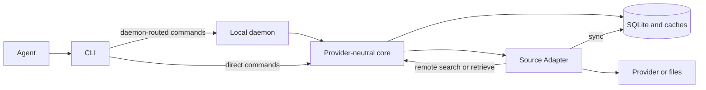
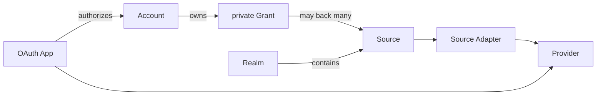

# ctxindex system reference

> **NON-NORMATIVE.** This is a readable projection of the current system. If it
> conflicts with `openspec/specs/<capability>/spec.md`, the capability spec wins.
>
> **Last refreshed:** 2026-10-01
>
> **Sources consulted:** `CONTEXT.md`; capability specs under
> `openspec/specs/` and their adjacent `implementation.md` sidecars (see
> section 13). This refresh rechecked daemon, storage, CLI, OAuth App, and
> distribution statements against `local-daemon`, `generic-storage`,
> `cli-surface`, and `oauth-client-management`. The active changes
> `complete-on-demand-daemon-lifecycle`, `promote-local-daemon-architecture`,
> `provide-official-oauth-apps`, and `ship-installable-npm-cli` were read only
> to label work that is not yet canonical. Code on `main` was spot-checked for
> the daemon and managed-App statements. Other sections carry forward from the
> 2026-07-22 refresh.

## 1. 10-minute tour

ctxindex gives agents one local CLI for context spread across providers and
files. Messages, calendar events, chats, and files become typed **Resources**
with stable `ctx://` **Refs**. External systems remain canonical; ctxindex keeps
searchable, purgeable local materializations.

```sh
npm install --global ctxindex
ctxindex init
ctxindex realm add personal
ctxindex source add local.directory --realm personal \
  --label notes --config-root-path /absolute/path/to/notes
ctxindex sync --source notes
ctxindex search "project plan" --realm personal
ctxindex get 'ctx://<source-id>/<adapter-owned-suffix>'
```

Canonical specs define one owner-private background daemon per runtime,
managed by `ctxindex daemon start|status|stop`. When a daemon is selected,
Realm, Source, `sync`, `status`, `search`, `get`, and `thread` run inside it.
The daemon owns SQLite and one immutable Extension registry, and the CLI opens
no database. If a selected daemon becomes unreachable, those commands fail with
exit `50` instead of falling back. Other stateful commands still run directly,
and they stop with exit `50` while a daemon owns the database.

The automatic lifecycle is not canonical yet. The active change
`complete-on-demand-daemon-lifecycle` defines it: stateful commands start the
daemon on demand, the daemon exits after five idle minutes, and Linux gets the
same ownership guarantees. Code on `main` already contains parts of this
behavior, but none of the change's tasks are checked off. Treat it as
provisional until the change is verified (section 12).

Two data paths return the same Resource and Ref model:


```mermaid
flowchart LR
  Agent --> CLI
  CLI -- daemon-routed commands --> D[Local daemon] --> Core[Provider-neutral core]
  CLI -- direct commands --> Core
  Core --> DB[(SQLite and caches)]
  Core --> A[Source Adapter] --> Canonical[Provider or files]
  A -- sync --> DB
  A -- remote search or retrieve --> Core
```

Use default output for people, `--format text` for low-token pipelines, and
`--format json` for agents. `sync --format events` streams JSON lines. Discover
the live interface with `ctxindex describe` and `ctxindex docs get-skill`.

## 2. Overview and value proposition

ctxindex discovers through local indexes/providers, retrieves complete context by
Ref, synchronizes selected Sources, and runs typed Profile Actions.

It is not a SaaS database, workflow engine, Extension command host, or MCP
server. The CLI is agent-facing; local RPC is private plumbing.

## 3. Domain model

| Term | Meaning |
| --- | --- |
| **Realm** | User-created reasoning scope containing Sources. Omitted filters span all Realms; explicit filters are exact. |
| **Source** | One globally labeled configured connection through one Source Adapter, in exactly one Realm. |
| **Provider** | Reusable external-service authentication, registration, base-scope, identity, and allowed-host definition. |
| **OAuth App** | Labeled public Extension metadata or local BYOA configuration for one Provider. |
| **Account** | Stable authenticated provider identity with a globally unique local label. |
| **Grant** | Private token, permission, and OAuth App snapshot owned by one Account and shared by compatible Sources. |
| **Profile** | Versioned portable Resource schema, fields, Relations, Artifacts, exports, aliases, and Actions. |
| **Source Adapter** | Provider-bound or providerless implementation of sync, remote search, retrieve, download, and Actions. |
| **Extension** | Plain composition root of Adapters and OAuth Apps, with optional standalone Providers, Profiles, and one documentation tree. |
| **Catalog** | Curated discovery data for exact Extension package replays. It is not a runtime registry. |
| **Resource** | Common envelope plus an optional Profile-validated payload. |
| **Ref** | Stable Source-scoped locator: `ctx://<source-id>/<adapter-opaque-suffix>`. |
| **Relation** | Typed edge to a Ref or a natural key that may resolve later. |
| **Artifact** | Descriptor for downloadable bytes associated with a Resource; cached bytes are separate. |
| **Materialization** | Purgeable local representation created by sync or ad-hoc access. |
| **Action** | Typed provider mutation declared by a Profile and invoked through one explicit Source. |
| **Draft** | Reversible provider-persisted proposed message; text in chat alone is not a Draft. |

## 4. Trust boundaries and security model

Provider data, SQLite, caches, and secrets stay local. Providers and files remain
canonical. Secret values live in the selected Keychain or encrypted-file
backend; config and SQLite store typed references. Backend moves are explicit
and copy, verify, commit, then clean up.

Provider requests use declared hosts. Diagnostics redact secrets, provider
bodies, paths, stacks, and transport internals. Realms are not security bounds.

Extensions are trusted in-process code. Repository, author-build, and install
trust are separate. Startup uses immutable bytes and performs no refresh.

The daemon's endpoint and metadata are owner-private. Retained kernel leases
ensure that one runtime owns a database: a daemon holds it exclusively, and
direct commands hold it shared. Canonical specs define that lease backend for
Darwin only. On a platform without a verified backend, `daemon start` fails
with an actionable error, and ordinary commands keep their direct behavior. A
Linux backend exists in code, but its contract is still in active changes.

## 5. Extension architecture

`@ctxindex/extension-sdk` owns authoring; `@ctxindex/profiles` owns portable
vocabulary; `@ctxindex/official` uses that same SDK for bundled definitions;
`@ctxindex/core` owns activation, orchestration, storage, and acquisition.

Imported Providers/Profiles are collected transitively. Same ids must be equal;
conflicts reject activation. Missing code preserves dependent Source data.

Install from npm, Git, local packages, or Catalogs publishes one exact immutable
root. Dependent Sources block uninstall unless forced; their data is preserved.

One passive Markdown/assets tree may accompany an Extension, separate from
generated registry reference. `docs list|get|search` exposes it offline.

## 6. OAuth Apps, Accounts, Grants, and Realms


```mermaid
flowchart LR
  App[OAuth App] -->|authorizes| Account -->|owns| Grant[private Grant]
  Grant -->|may back many| Source --> Adapter[Source Adapter] --> Provider
  Realm -->|contains| Source
  App --> Provider
```

OAuth App identity is exact `(provider id, label)`. Extensions may ship public
metadata; users may add BYOA config from Provider-declared environment variables.
`oauth-app add` and `account add --app` take an exact App label. The CLI never
defaults or guesses the label, even when a Provider has only one App.

Authorization uses Provider base scopes plus the active Adapter union.
Reauthorization updates the Grant; Account removal leaves Sources `needs_auth`.

The PKCE flow normally opens a browser. For a remote shell, the CLI accepts the
redirect URL or code through hidden stdin; secrets never become arguments.

Managed defaults are not canonical yet. The active change
`provide-official-oauth-apps` is implemented except for its provider Human
checkpoints. Under it, host release policy may select one exact managed App,
such as public Google or Microsoft App metadata, when `--app` is omitted. That
policy cannot change App identity or Adapter scopes. Provider policy may still
reject a managed App, so BYOA remains available.

## 7. Search and sync behavior

Search plans local, remote, or hybrid work per Source. Overrides and Realm/Source
filters are exact. A failed provider leg need not discard valid local results.

Remote continuations are distinct from local offsets. Ref retrieval may
materialize complete data ad hoc; threads follow generic Relations.

Sync transactionally commits Resources, projections, tombstones, and the next
cursor. Failure or cancellation rolls back partial work and records a typed
outcome. Per-Source ownership bounds concurrent writers.

## 8. Provider coverage and limitations

- `local.directory`: providerless file sync, search, and retrieval.
- `google.mailbox` and `microsoft.mailbox`: mail search/retrieval, threads,
  attachments/exports, and reversible Draft Actions.
- `google.calendar` and `microsoft.calendar`: read-only indexed calendar
  sync/retrieval; Microsoft uses an explicit rolling window.

Canonical Profiles are `mail.message@1`, `calendar.event@1`, `chat.message@1`,
and `file@1`; chat currently has no bundled provider Adapter.

## 9. Typed Actions and Drafts

Actions derive from Profiles and Adapter bindings and require one explicit
Source. Only `mail.message.draft.create` and `.update` exist; standalone/reply
inputs may use verified cached Artifacts. Neither provider can send.

## 10. Storage model

Core stores generic Sources, Resources, projections, Relations, Artifacts, and
sync state in SQLite. Adapters own no tables; projections derive from validated
Resource payloads.

Refs are public identity; row ids are not. The same provider record through two
Sources remains two Resources. Relations never silently deduplicate them.

Provider identifiers may appear in Source-scoped Resource Refs, envelope metadata, or typed Profile fields; there is no separate external-reference store.
For `mail.message`, `rfcMessageId` is the normalized RFC `Message-ID`
header value. Natural-key Relations resolve through the field index to
zero-to-many matches across Sources, preserving each Source-scoped Ref.
Cross-Source Resource collapse, canonical identity, and merge policy are deferred.

Artifacts are Source-scoped, Profile-derived Artifact descriptors. Provider bytes are fetched on demand into the managed content-addressed cache; descriptors
outlive cached bytes. Materializations are purgeable and providers stay canonical.

## 11. CLI surface and stable exits

The CLI uses Citty for parsing/help. `describe` reports loaded definitions,
schemas, fields, formats, auth, and capabilities. `docs get-skill` emits the
release-matched portable Agent Skill.

Reads support `pretty`, escaped `text`, and compact `json`; `-f` aliases
`--format`, while `-s`, `-r`, and `-l` cover frequent selectors. Values are not
truncated and diagnostics stay off JSON stdout.

Stable exits are `0` success, `2` invalid usage, `10` authorization required,
`20` rate-limited, `30` network/provider/acquisition failure, `40` permission
denied, `50` other bounded failure, and `130` cancellation.

## 12. Known limitations and deferrals

- No email sending, calendar mutation, or arbitrary provider mutation.
- No remote/public RPC, batching, OpenAPI SDK, service installation, queue,
  scheduler, semantic retrieval, or cross-source identity merging.
- No automatic Artifact eviction by age, quota, or storage pressure.
- Extension updates are explicit; Catalog refresh never changes installed bytes.
- The runtime is currently Bun-based; Node compatibility is not promised.
- Provider verification and organizational tenant policy remain external to the
  local architecture.
- Not yet canonical, because their contracts are in active changes:
  - automatic daemon startup, shutdown after five idle minutes, and Linux
    daemon ownership (`complete-on-demand-daemon-lifecycle`; partly present in
    code, with no tasks verified);
  - routing every remaining stateful command through the daemon
    (`promote-local-daemon-architecture`);
  - managed OAuth App defaults (`provide-official-oauth-apps`; awaiting
    provider Human checkpoints).
- The published `ctxindex` npm package has no canonical capability spec yet.
  Its packaging and release contract lives in the active change
  `ship-installable-npm-cli`; `cli-distribution` has only a sidecar.

## 13. Source index

Paths below are capability directories under `openspec/specs/`. Each has a
`spec.md`, except `cli-distribution`, `official-oauth-apps`, and
`github-issues-demo`, which so far have only `implementation.md` sidecars. Sidecars describe package seams,
codemaps describe layout, and milestone files are historical only.

| Section | Sources |
| --- | --- |
| 1. Tour | `CONTEXT.md`; `cli-surface`, `local-daemon`, `sync-operations`, `search-routing`, `documentation-consumption` |
| 2. Overview | `CONTEXT.md`; `module-architecture`, `cli-surface` |
| 3. Domain model | `CONTEXT.md`; `core-model` |
| 4. Trust boundaries | `secret-backend-operations`, `generic-storage`, `local-daemon`, `extension-installation`, `extension-loading` |
| 5. Extensions | `extension-loading`, `extension-installation`, `extension-catalogs`, `extension-documentation`, `extension-sdk-distribution`, `documentation-consumption`, `module-architecture` |
| 6. OAuth and Realms | `oauth-client-management`, `account-grant-management`, `realm-and-source-management`, `cli-surface`; planned: `provide-official-oauth-apps` change, `official-oauth-apps` sidecar |
| 7. Search and sync | `search-routing`, `sync-operations`, `daemon-operation-streams`, `retrieval-and-artifacts` |
| 8. Provider coverage | `microsoft-graph-adapters`, `google-calendar-adapter`, `calendar-context`, `profile-vocabulary`, `retrieval-and-artifacts` |
| 9. Actions and Drafts | `provider-actions`, `profile-vocabulary` |
| 10. Storage | `generic-storage`, `core-model`, `retrieval-and-artifacts` |
| 11. CLI and exits | `cli-surface`, `error-taxonomy`, `documentation-consumption` |
| 12. Limitations | The capabilities above; active changes `complete-on-demand-daemon-lifecycle`, `promote-local-daemon-architecture`, `provide-official-oauth-apps`, `ship-installable-npm-cli` |

`docs-web-surface` (the website) and the `github-issues-demo` sidecar (an
external example) do not add to this projection.
