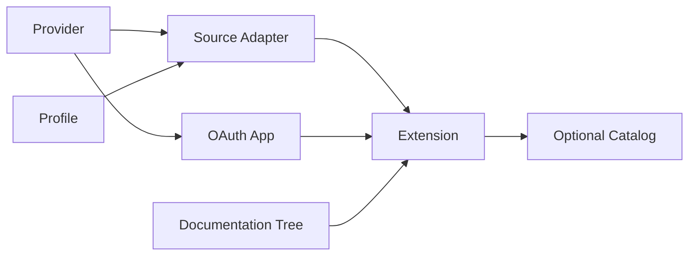

Built-in and external Extensions use the same `@ctxindex/extension-sdk` factories and the same collection, conflict, and complete-registry validation path. Built-ins have distribution privilege, not a private API.

The fastest way to learn the public seam is the standalone [`barisgit/ctxindex-extensions`](https://github.com/barisgit/ctxindex-extensions) repository. It imports only `@ctxindex/extension-sdk@0.1.1` and `@ctxindex/profiles@0.1.1`, exports one Extension and one Catalog from `index.ts`, and tests provider traffic with synthetic responses.



## The definitions

| Definition | Owns |
| --- | --- |
| **Provider** | External-service identity, authentication, registration policy, base scopes, and allowed hosts |
| **Profile** | Versioned Resource schema, search vocabulary, Relations, Artifacts, exports, and Action declarations |
| **Source Adapter** | Source configuration, optional exact Provider, Adapter-specific access, capabilities, and operation/Action implementations |
| **OAuth App** | One labeled public OAuth registration configuration bound to an exact imported OAuth2 Provider |
| **Extension** | One plain exported root composing Adapters, OAuth Apps, optional standalone leaves, and one passive Documentation Tree |
| **Catalog** | Optional curation of literal or npm/Git/local Extension entries; not runtime composition |

The SDK also exports its supported `z` so schemas and factory inference use one convenient public import.

## Exact imports are the graph

There are no textual Provider/Profile references and no Extension dependency graph for ctxindex to resolve. If an Adapter uses a definition from another package, import that value normally:

```ts
import { defineAdapter, z } from '@ctxindex/extension-sdk'
import { issueProfile, projectProvider } from '@acme/project-context'

export const boardAdapter = defineAdapter({
  id: 'team.board',
  provider: projectProvider,
  access: { scopes: ['boards.read'] },
  providerApiHosts: ['api.example.com'],
  configSchema: z.object({ board: z.string() }).strict(),
  profiles: [issueProfile],
  routing: 'indexed',
  capabilities: [],
  operations: {},
  actions: {},
})
```

npm, Git, and local dependencies are ordinary package dependencies. The package manager makes imports available before ctxindex loads the package. If the exact same imported leaf appears through multiple Extension roots it may coalesce; independently redefined same-id executable/schema-bearing leaves conflict rather than winning by load order.

## Choose a path

| Goal | Start here |
| --- | --- |
| Index local data or synthetic fixtures | [Providerless quickstart](/docs/extend/providerless) |
| Call a public or authenticated API | [Provider-backed quickstart](/docs/extend/provider-backed) |
| Make a Git/local/npm package installable | [Package, test, and publish](/docs/extend/package-test-publish) |
| Define portable Resource meaning | [Profiles](/docs/extend/profiles) |
| Implement sync, search, retrieve, downloads, or Actions | [Adapters and Actions](/docs/extend/adapters-actions) |
| Add OAuth policy or a public App | [Providers and OAuth Apps](/docs/extend/providers-oauth-apps) |
| Ship Markdown and image assets | [Extension documentation](/docs/extend/documentation) |
| Curate several Extensions | [Catalogs](/docs/extend/catalogs) |

## Authoring rules that prevent surprises

- Export ordinary `defineExtension(...)` or `defineCatalog(...)` values from modules listed in `package.json`; there is no host callback or factory-of-factories.
- Import reusable Provider and Profile values through normal TypeScript dependencies. ctxindex does not resolve textual definition references or a second Extension dependency graph.
- Keep Provider I/O inside Adapter operation contexts and use the supplied `fetch`, logger, and cancellation signal.
- Validate Source config, provider responses, cursors, and Action inputs. SDK types improve authoring; runtime schemas remain authoritative at the trust boundary.
- Treat docs as a passive sidecar. They explain definitions but cannot change schemas, scopes, capabilities, or Actions.

Use `ctxindex describe --full --format json` after installation to inspect the exact registry ctxindex activated.
