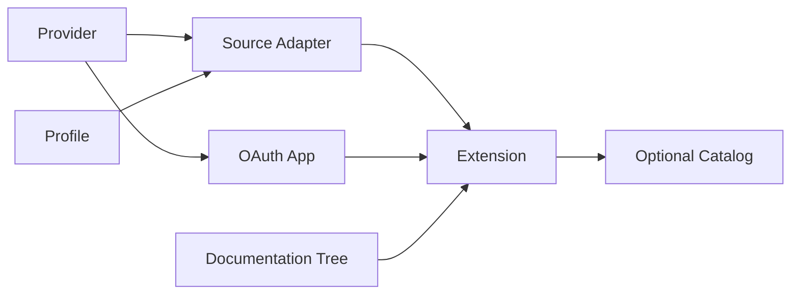

Built-in and external Extensions use the same `@ctxindex/extension-sdk` factories and the same collection, conflict, and complete-registry validation path. Built-ins have distribution privilege, not a private API.



## The definitions

| Definition | Owns |
| --- | --- |
| **Provider** | External-service identity, authentication, registration policy, base scopes, and allowed hosts |
| **Profile** | Versioned Resource schema, search vocabulary, Relations, Artifacts, exports, and Action declarations |
| **Source Adapter** | Source configuration, optional exact Provider, Adapter-specific access, capabilities, and operation/Action implementations |
| **OAuth App** | One labeled public OAuth registration configuration bound to an exact imported OAuth2 Provider |
| **Extension** | One plain exported root composing Adapters, OAuth Apps, optional standalone leaves, and one passive Documentation Tree |
| **Catalog** | Optional curation of literal or npm/Git/local Extension entries; not runtime composition |

The SDK also exports its supported `z` so schemas and factory inference use one convenient public import.

## Exact imports are the graph

There are no textual Provider/Profile references and no Extension dependency graph for ctxindex to resolve. If an Adapter uses a definition from another package, import that value normally:

```ts
import { defineAdapter, z } from '@ctxindex/extension-sdk'
import { issueProfile, projectProvider } from '@acme/project-context'

export const boardAdapter = defineAdapter({
  id: 'team.board',
  provider: projectProvider,
  access: { scopes: ['boards.read'] },
  providerApiHosts: ['api.example.com'],
  configSchema: z.object({ board: z.string() }).strict(),
  profiles: [issueProfile],
  routing: 'indexed',
  capabilities: [],
  operations: {},
  actions: {},
})
```

npm, Git, and local dependencies are ordinary package dependencies. The package manager makes imports available before ctxindex loads the package. If the exact same imported leaf appears through multiple Extension roots it may coalesce; independently redefined same-id executable/schema-bearing leaves conflict rather than winning by load order.

## Choose a path

- [Providerless quickstart](/docs/extend/providerless): local data, generated fixtures, or APIs that need no ctxindex Account.
- [Provider-backed quickstart](/docs/extend/provider-backed): OAuth identity, scoped provider egress, and remote operations.
- [Package, test, and publish](/docs/extend/package-test-publish): manifest entries, direct installation, dependencies, and release.
