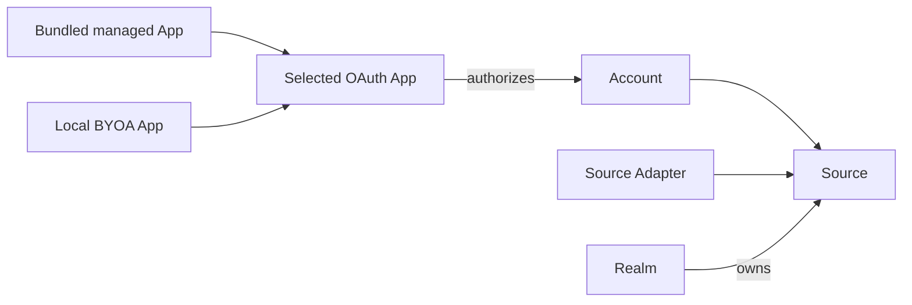

A provider-backed Source needs three separate things: an available **OAuth App** definition, an authorized **Account**, and a configured **Source** using one Source Adapter.

Both App paths lead to the same local model. The selected OAuth App authorizes an Account; a Source then combines that Account with one compatible Source Adapter inside an exact Realm.



## Inspect available OAuth Apps

```sh
ctxindex oauth-app list --format json
```

Bundled Google and Microsoft Extensions may expose public desktop OAuth Apps. ctxindex selects one as the managed default only when host policy exactly matches its Provider, label, owning Extension, and bundled provenance.

<Callout type="warn">
  **The bundled Google and Microsoft OAuth Apps are not verified.** I maintain
  ctxindex as an individual and cannot get them verified at the moment.
  Provider verification can also take several weeks. This may change later.
</Callout>

### Microsoft

Microsoft should still work without verification, especially for personal Microsoft Accounts and organizational tenants that allow user consent. A Microsoft 365 administrator can still require admin consent or block unverified Apps.

### Google

Google may show an unverified-app warning, restrict access to configured test users, or block requested scopes. If the bundled App does not work for your Google identity, configure local BYOA instead.

## Authorize an Account

When a policy-qualified managed App is available:

```sh
ctxindex account add microsoft --label work
```

For deterministic bring-your-own-app setup, configure the Provider-authored environment variables once, persist a labeled local OAuth App, and select it exactly:

```sh
ctxindex oauth-app add microsoft my-app --from-env
ctxindex account add microsoft --app my-app --label work
```

The public App inventory never exposes App config, client ids, desktop-secret metadata, token data, secret references, or secret values.

## Add Sources

List loaded Source Adapters and inspect the generated config schema before adding a Source:

```sh
ctxindex describe adapter microsoft.mailbox --format json
ctxindex source add microsoft.mailbox \
  --realm company \
  --account work \
  --label work-mail
ctxindex sync --source work-mail --format json
```

Repeat with a calendar Adapter only when you need that collection. Accounts can back multiple compatible Sources; a Source always belongs to exactly one Realm.

<Callout type="warn">
  Never paste credentials into an agent conversation or commit `.env` files. OAuth App configuration and Grants are local private state.
</Callout>
