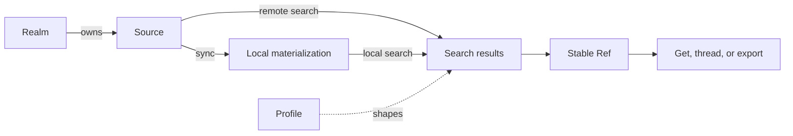

Every ctxindex workflow uses the same small model:

1. A **Realm** groups Sources that should be searched and reasoned about together.
2. A **Source** connects one provider collection or local directory through one Source Adapter.
3. A **Profile** gives Resources portable shape, search vocabulary, Relations, Artifacts, exports, and Actions.
4. A **Ref** addresses one Resource independently of local materialization.

The diagram shows the ordinary read path. A Realm owns Sources; each Source either materializes Resources locally or searches its provider, and every result hands back a stable Ref.



## Inspect loaded vocabulary

```sh
ctxindex describe --format json
ctxindex describe profile mail.message --format json
ctxindex describe adapter microsoft.mailbox --format json
```

Use the compact default for orientation and request `describe --full --format json` only when you need the complete registry snapshot.

## Materialize deliberately

```sh
ctxindex sync --realm company --format json
ctxindex status --realm company --format json
```

Sync is a strategy for fast local discovery. Providers and files remain canonical. Purging local materializations does not delete provider records.

## Search, then follow the Ref

```sh
ctxindex search "quarterly planning" --realm company --format json
ctxindex get 'ctx://…' --format json
ctxindex thread 'ctx://…' --format json
ctxindex export 'ctx://…' --format json
```

An omitted Realm considers every eligible Realm. An explicit Realm filter is exact; there is no implicit global Realm and no Realm includes another.

## Act through a Source

```sh
ctxindex describe action mail.message.draft.create \
  --source work-mail \
  --format json
```

Actions are typed Profile mutations implemented by a Source Adapter. Current provider mutation stops at reversible email Draft creation and update. ctxindex never sends email.

Read the focused [mail](/docs/use/mail), [calendar](/docs/use/calendar), and [agent](/docs/start/agent-usage) guides next.
