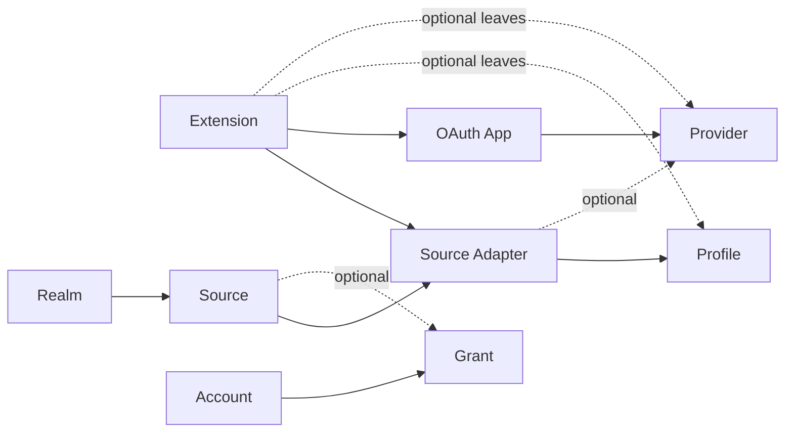

# ctxindex V1 architecture decisions

Status: accepted on 2026-07-13 and 2026-07-14. This is a concise historical
decision record, not the current behavior contract. Normative behavior lives in
[`openspec/specs/`](../../openspec/specs/); current terminology lives in
[`CONTEXT.md`](../../CONTEXT.md).

## Product boundary

ctxindex is the local gateway through which agents discover, retrieve,
materialize, and perform typed Actions on a person's context. Providers and
files remain canonical; local indexing is one strategy for fast discovery.

The product exposes four generic operations over configured Sources:

1. **Discover** through local indexes, providers, or both.
2. **Retrieve** complete Resources, threads, Artifacts, and exports by Ref.
3. **Sync** selected Sources into purgeable local projections.
4. **Act** through Profile-declared, Adapter-implemented provider mutations.

Agent workflow policy stays outside ctxindex. Agents compose the CLI; they do
not receive provider-specific command families, arbitrary Extension commands,
or a second MCP integration surface. Provider mutations currently stop at
reversible email Draft creation and update.

## Decisions D1-D22

| # | Subject | Accepted decision |
| --- | --- | --- |
| D1 | Extension power | Extensions contribute typed definitions and Adapters, not arbitrary CLI subcommands. |
| D2 | Loading | Trusted TypeScript/JavaScript loads in-process. Host contexts carry effects; an out-of-process protocol is deferred. |
| D3 | Distribution | Keep a Bun-compiled CLI. External packages depend on the public Extension SDK, never core internals. Bun is pinned to 1.3.14 and compiled external-Extension loading is a release gate. |
| D4 | Refs | Every Resource uses `ctx://<source-id>/<adapter-opaque-suffix>`, whether materialized or remote. Provider URLs remain metadata. |
| D5 | Authentication | Providers declare `oauth2` or `none`; core owns authorization, refresh, and uniform auth failures. Add other auth forms only for a concrete Provider. |
| D6 | Sources | A Source is one configured connection. Sync is a capability and per-Source choice, not a second source type. |
| D7 | Search | Hybrid routing is the default candidate; Source coverage and Adapter capabilities decide local versus remote work. `--local-only` and `--remote` are explicit overrides. Revisit with evidence. |
| D8 | Artifacts | Bytes use a managed content-addressed cache and explicit purge. Copying to `--output` does not transfer canonical ownership. |
| D9 | Resource shape | Use a small provider-neutral envelope plus a Profile-validated payload. |
| D10 | Profile composition | The API may compose Profiles; V1 uses one primary Profile plus derived Artifact descriptors. |
| D11 | Authoring | Use inference-friendly factories such as `defineExtension`, `defineAdapter`, and `defineProfile`, with schema-backed runtime validation. |
| D12 | Unknown Profile versions | Preserve an envelope-only degraded Resource and warn instead of inventing semantics. |
| D13 | Storage | Keep generic core tables. No per-Profile or Adapter-private tables; add an Extension storage API only with demonstrated need. |
| D14 | Relations | Store bidirectional logical edges to either a Ref or a lazily resolved natural key. |
| D15 | Exports | Profiles own named export renderers; core exposes one generic export verb. No universal conversion pipeline. |
| D16 | Capabilities | Adapters declare canonical operation classes (`sync`, remote search, retrieve, download); routing mode is separate. |
| D17 | Extension acquisition | Activate package-declared Extension entry modules through one manifest/collector seam. Local, Git, npm, and Catalog installs now converge on immutable managed records. |
| D18 | CLI dynamism | Generate kinds, fields, formats, Actions, and Adapter options from loaded registries and schemas. Never declare the same vocabulary twice. |
| D19 | Documentation | An Extension may declare one passive Markdown/assets sidecar. It is validated and projected separately from generated registry reference data and never changes definition identity. |
| D20 | Realms | Every Source belongs to one user-created Realm. There is no `global` Realm; omitted filters span all Realms and explicit filters are exact. Realms are not security boundaries. |
| D21 | Actions | Profiles declare typed Actions; Adapters implement them through an explicit Source. V1 permits reversible email Draft create/update only. |
| D22 | Baseline | This architecture was the first product baseline. Prototype data created before a released compatibility promise was disposable. |

## Definition and runtime graph

Profiles own portable vocabulary. Providers own reusable authorization policy.
Adapters bind operations to Profiles and optionally one Provider. Extensions are
plain composition roots; imported exact values form the type-safe graph.

Canonical Profiles bundled with the binary: `mail.message@1`, `chat.message@1`, `calendar.event@1`, and `file@1`.
V1 uses one primary Profile plus Artifact descriptors per Resource.

Core owns Sources, Realms, Resources, Refs, storage, routing, validation, and
orchestration. Profiles define domain meaning; Adapters perform provider or
filesystem I/O. Extensions only bundle definitions. This keeps core generic
without reducing domain data to untyped blobs.

## Trust and acquisition

An Extension executes in-process and therefore receives full user trust.
Runtime schemas protect registry consistency, not the host from malicious code.
Catalog repository trust, Catalog-author build trust, and install/update
execution trust are separate acknowledgements. Once installed, startup uses the
immutable local pin and performs no ambient refresh or acquisition.

OAuth Apps are ordinary definitions or local BYOA state. Host release policy may
select one exact Extension App as a managed default, but that policy does not
change definition identity or Adapter-requested scopes. Tokens, App snapshots,
Accounts, and Grants remain local.

## Deliberate deferrals

- sending email and other consequential provider mutations;
- arbitrary Extension commands and workflow-policy engines;
- an Extension-private storage API and Adapter-private tables;
- multi-primary-Profile Resources and cross-source identity merging;
- stored-payload migration machinery before a second real Profile version;
- out-of-process/non-TypeScript Adapters;
- semantic retrieval, push synchronization, and remote daemon access until
  their simpler prerequisites are proven.

## Documentation ownership

- [`CONTEXT.md`](../../CONTEXT.md) owns ubiquitous language and relationships.
- [`openspec/specs/`](../../openspec/specs/) owns normative capability behavior.
- Adjacent `implementation.md` sidecars own selective implementation doctrine.
- [`SYSTEM.md`](../../SYSTEM.md) is the current non-normative whole-system tour.
- [`docs/milestones/V1_0.md`](../milestones/V1_0.md) and
  [`V1_1.md`](../milestones/V1_1.md) are completed historical scope records.
- This file owns the cross-cutting rationale and decisions D1-D22.
